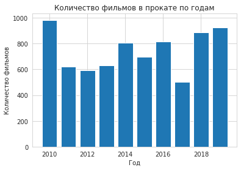
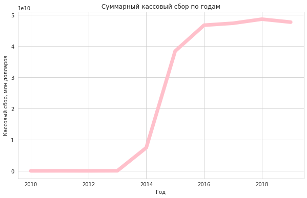
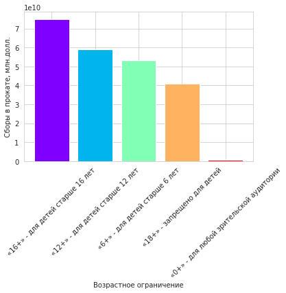
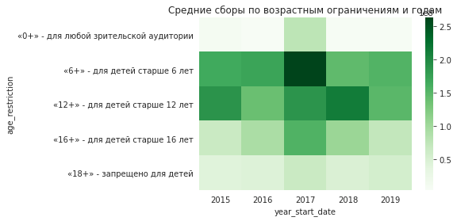
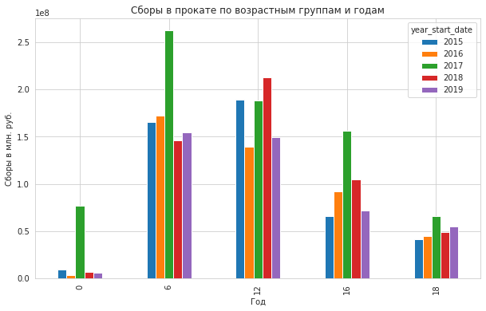
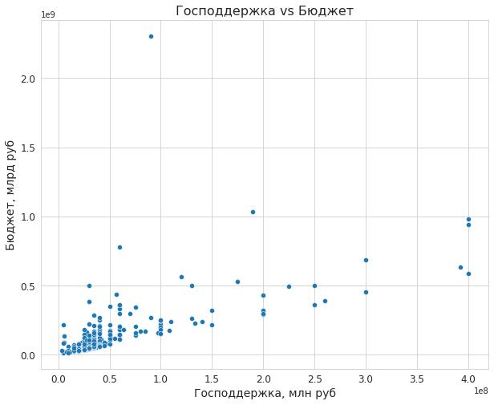
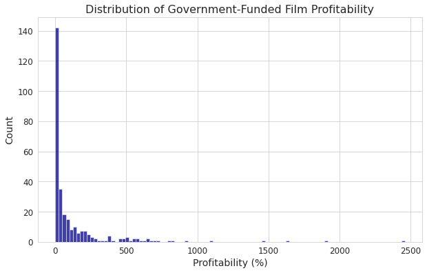
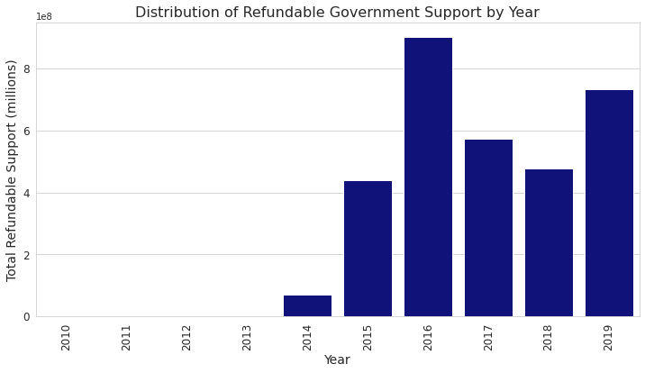
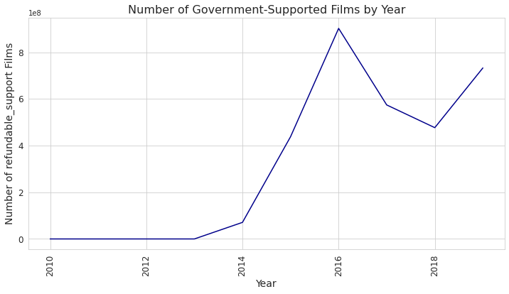
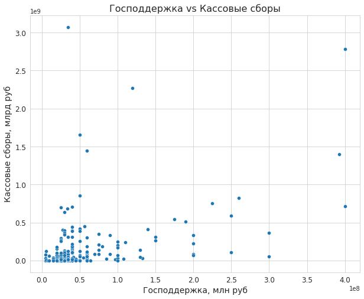

<div style="border:solid Chocolate 2px; padding: 40px">

<b>Привет!👋</b>

Меня зовут Огурлиев Анзор, я буду ревьюером твоего проекта. Сразу хочу предложить тебе общаться на "ты", если тебе это неудобно, скажи мне об этом. Нам предстоит пройти с тобой через тернистый и от того интересный путь анализа данных! Можешь не переживать, я всегда помогу тебе, если у тебя возникнут вопросы)

По ходу твоей работы я буду оставлять свои комментарии, по выполненным тобой шагам. Попрошу тебя не удалять их, так мне будет проще отслеживать твой прогресс в случае повторной проверки.

Очень важно вести диалог и обсуждать те пункты, которые у тебя могли не получиться, поэтому, ты можешь оставлять свои комментарии, и мы обязательно во всем разберемся! Самое главное - выделяй свои комментарии удобным для тебя способом (цвет, рамка), но так, чтобы они отчетлитво отличались от моих комментариев. Так мы ни в чем не запутаемся)

Свои комментарии я буду выделять так: <font color='green'>зеленый</font>, <font color='gold'>желтый</font> и <font color='red'>красный</font> цвет, например:

<br/>

<div class="alert alert-success">
<h2> Комментарий ревьюера V1<a class="tocSkip"> </h2>

<b>Все отлично!👍:</b> Этот комментарий я буду оставлять, если твое решение оптимально для данного шага.
</div>

<br/>

<div class="alert alert-warning">
    <h2> Комментарий ревьюера V1<a class="tocSkip"> </h2>

<b>Некоторые замечания и рекомендации💡:</b> Это не означает, что ты совершил ошибку. Такими комментариями я буду отмечать места, где ты справился с задачей, но её можно решить ещё лучше. Также в таких комментариях я буду оставлять для тебя другие советы.
</div>


<br/>
<div class="alert alert-block alert-danger">
<h2> Комментарий ревьюера V1<a class="tocSkip"></h2>


<b>На доработку🤔:</b>
Если решение, которое ты применил на определенном шаге, требует значительных изменений, то я буду оставлять такой комментарий. Тебе нужно будет подумать еще раз как правильным образом решить данный этап. Если ревью содержит такие комментарии, то я не смогу принять проект с первого раза.
</div>

P.S. В оглавлении комментария ты увидишь `V1` (`V1`, `V2`, `V3`) - это версия моего комментария, которая понадобится нам с тобой, чтобы не запутаться, если потребуется оставить тебе комментарии после первой проверки.

## Исследование данных о российском кинопрокате


### Шаг 1. Откройте файлы с данными и объедините их в один датафрейм. 

Объедините данные таким образом, чтобы все объекты из датасета `mkrf_movies` обязательно вошли в получившийся датафрейм. 

<div id="accordion">
    <div class="card">
        <div class="card-header" id="headingThree">
            <button class="btn btn-link collapsed" data-toggle="collapse" data-target="#collapseHint_0" aria-expanded="false" aria-controls="collapseHint_0">Подсказка</button>
        </div>
        <div id="collapseHint_0" class="collapse" aria-labelledby="headingThree" data-parent="#accordion">
            <div class="card-body">
Обратите внимание на тип данных столбца, по которому будете соединять датафреймы. Тип данных этих столбцов должен быть одинаковым в обоих датафреймах.
            </div>
        </div>
    </div>
</div>

Цель данного исследования заключается в анализе рынка российского кинопроката и выявлении существующих трендов.

Особое внимание мы уделим таким фильмам, которые получили государственную поддержку. Посмотрим, есть ли интерес у зрителя к таким фильмам.

В результате исследования мы планируем получить более глубокое понимание рынка кинопроката в России и выработаем рекомендации для заинтересованных сторон в индустрии кино.

**Описание данных**

- title — название фильма;
- puNumber — номер прокатного удостоверения;
- show_start_date — дата премьеры фильма;
- type — тип фильма;
- film_studio — студия-производитель;
- production_country — страна-производитель;
- director — режиссёр;
- producer — продюсер;
- age_restriction — возрастная категория;
- refundable_support — объём возвратных средств государственной поддержки;
- nonrefundable_support — объём невозвратных средств государственной поддержки;
- financing_source — источник государственного финансирования;
- budget — общий бюджет фильма;
- ratings — рейтинг фильма на КиноПоиске;
- genres — жанр фильма;
- box_office - сборы в рублях

<div class="alert alert-success">
<h2> Комментарий ревьюера V1<a class="tocSkip"> </h2>

<b>Все отлично!👍:</b> Отличный вывод, все четко, понятно и структурировано. Вывод в полной мере отражает существующие зависимости, и по нему можно принимать дальнейшие решения.
</div>

Импортируем библиотеки pandas и numpy для работы с данными и чтения csv-файлов.


```python
# Импортируем библиотеки:
import pandas as pd
import numpy as np
import seaborn as sns
import matplotlib.pyplot as plt
from datetime import datetime

# Установим максимальное количество отображаемых столбцов в таблицах
pd.options.display.max_columns = None

# Откроем файлы с данными
movies = pd.read_csv('/datasets/mkrf_movies.csv')
shows = pd.read_csv('/datasets/mkrf_shows.csv')

# Отобразим первые 5 строк таблицы "movies"
display(movies.head())

# Отобразим первые 5 строк таблицы "shows"
display(shows.head())
```


<div>
<style scoped>
    .dataframe tbody tr th:only-of-type {
        vertical-align: middle;
    }

    .dataframe tbody tr th {
        vertical-align: top;
    }

    .dataframe thead th {
        text-align: right;
    }
</style>
<table border="1" class="dataframe">
  <thead>
    <tr style="text-align: right;">
      <th></th>
      <th>title</th>
      <th>puNumber</th>
      <th>show_start_date</th>
      <th>type</th>
      <th>film_studio</th>
      <th>production_country</th>
      <th>director</th>
      <th>producer</th>
      <th>age_restriction</th>
      <th>refundable_support</th>
      <th>nonrefundable_support</th>
      <th>budget</th>
      <th>financing_source</th>
      <th>ratings</th>
      <th>genres</th>
    </tr>
  </thead>
  <tbody>
    <tr>
      <th>0</th>
      <td>Открытый простор</td>
      <td>221048915</td>
      <td>2015-11-27T12:00:00.000Z</td>
      <td>Художественный</td>
      <td>Тачстоун Пикчерз, Кобальт Пикчерз, Бикон Пикче...</td>
      <td>США</td>
      <td>Кевин Костнер</td>
      <td>Дэвид Валдес, Кевин Костнер, Джейк Эбертс</td>
      <td>«18+» - запрещено для детей</td>
      <td>NaN</td>
      <td>NaN</td>
      <td>NaN</td>
      <td>NaN</td>
      <td>7.2</td>
      <td>боевик,драма,мелодрама</td>
    </tr>
    <tr>
      <th>1</th>
      <td>Особо важное задание</td>
      <td>111013716</td>
      <td>2016-09-13T12:00:00.000Z</td>
      <td>Художественный</td>
      <td>Киностудия "Мосфильм"</td>
      <td>СССР</td>
      <td>Е.Матвеев</td>
      <td>NaN</td>
      <td>«6+» - для детей старше 6 лет</td>
      <td>NaN</td>
      <td>NaN</td>
      <td>NaN</td>
      <td>NaN</td>
      <td>6.6</td>
      <td>драма,военный</td>
    </tr>
    <tr>
      <th>2</th>
      <td>Особо опасен</td>
      <td>221038416</td>
      <td>2016-10-10T12:00:00.000Z</td>
      <td>Художественный</td>
      <td>Юниверсал Пикчерз, Кикстарт Продакшнз, Марк Пл...</td>
      <td>США</td>
      <td>Тимур Бекмамбетов</td>
      <td>Джим Лемли, Джейсон Нетер, Марк Е.Платт, Яйн Смит</td>
      <td>«18+» - запрещено для детей</td>
      <td>NaN</td>
      <td>NaN</td>
      <td>NaN</td>
      <td>NaN</td>
      <td>6.8</td>
      <td>фантастика,боевик,триллер</td>
    </tr>
    <tr>
      <th>3</th>
      <td>Особо опасен</td>
      <td>221026916</td>
      <td>2016-06-10T12:00:00.000Z</td>
      <td>Художественный</td>
      <td>Юниверсал Пикчерз, Кикстарт Продакшнз, Марк Пл...</td>
      <td>США</td>
      <td>Тимур Бекмамбетов</td>
      <td>Джим Лемли, Джейсон Нетер, Марк Е.Платт, Яйн Смит</td>
      <td>«18+» - запрещено для детей</td>
      <td>NaN</td>
      <td>NaN</td>
      <td>NaN</td>
      <td>NaN</td>
      <td>6.8</td>
      <td>фантастика,боевик,триллер</td>
    </tr>
    <tr>
      <th>4</th>
      <td>Особо опасен</td>
      <td>221030815</td>
      <td>2015-07-29T12:00:00.000Z</td>
      <td>Художественный</td>
      <td>Юниверсал Пикчерз, Кикстарт Продакшнз, Марк Пл...</td>
      <td>США</td>
      <td>Тимур Бекмамбетов</td>
      <td>Джим Лемли, Джейсон Нетер, Марк Е.Платт, Яйн Смит</td>
      <td>«18+» - запрещено для детей</td>
      <td>NaN</td>
      <td>NaN</td>
      <td>NaN</td>
      <td>NaN</td>
      <td>6.8</td>
      <td>фантастика,боевик,триллер</td>
    </tr>
  </tbody>
</table>
</div>


<div>
<style scoped>
    .dataframe tbody tr th:only-of-type {
        vertical-align: middle;
    }

    .dataframe tbody tr th {
        vertical-align: top;
    }

    .dataframe thead th {
        text-align: right;
    }
</style>
<table border="1" class="dataframe">
  <thead>
    <tr style="text-align: right;">
      <th></th>
      <th>puNumber</th>
      <th>box_office</th>
    </tr>
  </thead>
  <tbody>
    <tr>
      <th>0</th>
      <td>111000113</td>
      <td>2.450000e+03</td>
    </tr>
    <tr>
      <th>1</th>
      <td>111000115</td>
      <td>6.104000e+04</td>
    </tr>
    <tr>
      <th>2</th>
      <td>111000116</td>
      <td>1.530300e+08</td>
    </tr>
    <tr>
      <th>3</th>
      <td>111000117</td>
      <td>1.226096e+07</td>
    </tr>
    <tr>
      <th>4</th>
      <td>111000118</td>
      <td>1.636841e+08</td>
    </tr>
  </tbody>
</table>
</div>


```python
movies.info()
```

    <class 'pandas.core.frame.DataFrame'>
    RangeIndex: 7486 entries, 0 to 7485
    Data columns (total 15 columns):
     #   Column                 Non-Null Count  Dtype  
    ---  ------                 --------------  -----  
     0   title                  7486 non-null   object 
     1   puNumber               7486 non-null   object 
     2   show_start_date        7486 non-null   object 
     3   type                   7486 non-null   object 
     4   film_studio            7468 non-null   object 
     5   production_country     7484 non-null   object 
     6   director               7477 non-null   object 
     7   producer               6918 non-null   object 
     8   age_restriction        7486 non-null   object 
     9   refundable_support     332 non-null    float64
     10  nonrefundable_support  332 non-null    float64
     11  budget                 332 non-null    float64
     12  financing_source       332 non-null    object 
     13  ratings                6519 non-null   object 
     14  genres                 6510 non-null   object 
    dtypes: float64(3), object(12)
    memory usage: 877.4+ KB


Типы данных: столбцы имеют тип object, а некоторые столбцы - float64.

В столбцах имеются пропущенные значения (NaN) в некоторых случаях, особенно для столбцов с информацией о государственной поддержке и бюджете фильмов. Это может усложнить проведение анализа и обработку данных.

Имеющиеся данные содержат информацию о фильмах, выпущенных в определенном регионе, их бюджете, жанрах, рейтинге, студии-производителе, странах производства, возрастных ограничениях и других характеристиках. 

Кроме того, в данных присутствуют информация о финансировании, в том числе: обеспечение поддержки (возвратной и невозвратной), размер бюджета и источники финансирования. 

Особое внимание стоит обратить на то, что данные о финансировании присутствуют только для части фильмов.

Также в данных присутствуют информация об участниках процесса создания фильма, включая режиссеров и продюсеров. 

<div class="alert alert-success">
<h2> Комментарий ревьюера V1<a class="tocSkip"> </h2>

<b>Все отлично!👍:</b> Правильно рассмотрела данные, с которыми предстоит работать.

Осуществляем приведение столбца puNumber из разных таблиц к числовому значению


```python
# Если в таблице movies в столбце puNumber есть строки, то приводим их в числовые значения. 
# Если значение не может быть преобразовано в число, тогда оно заменяется на NaN

movies['puNumber'] = pd.to_numeric(movies['puNumber'],errors='coerce')
```


```python
# В таблице shows в стобце puNumber числовые значения 
# метод astype() преобразует все значения в столбце "puNumber" к типу float64.

shows['puNumber'] = shows['puNumber'].astype('float64')
```

<div class="alert alert-success">
<h2> Комментарий ревьюера V1<a class="tocSkip"> </h2>

<b>Все отлично!👍:</b> Правильно обработала данный столбец.


```python
# Выполнив данный код, таблица "df" будет содержать информацию о фильмах (из таблицы "df_movies"), 
# включая номера прокатных удостоверений, приведенные к числовому формату.
# Мы объединили таблицы df_movies и df_shows по столбцу puNumber и вернули обновленный столбец df

df = pd.merge(movies, shows, on='puNumber', how='left')
```

Лучше изменить название столбца puNumber. Делается это для лучшей читаемости кода и понимания данных. Нас учили приводить все буквы в пайтон к нижнему регистру, это считается хорошим тоном. Лучше использовать более понятные и информативные названия столбцов, которые отражают их содержимое и помогают понимать структуру таблицы. Например, название puNumber может быть не очень ясным и сокращенным, тогда как pu_number более понятно и точно описывает содержимое столбца, так как визуально легче считывается человеческим глазом.


```python
df.rename(columns={'puNumber': 'pu_number'}, inplace=True)
df.head()
```


<div>
<style scoped>
    .dataframe tbody tr th:only-of-type {
        vertical-align: middle;
    }

    .dataframe tbody tr th {
        vertical-align: top;
    }

    .dataframe thead th {
        text-align: right;
    }
</style>
<table border="1" class="dataframe">
  <thead>
    <tr style="text-align: right;">
      <th></th>
      <th>title</th>
      <th>pu_number</th>
      <th>show_start_date</th>
      <th>type</th>
      <th>film_studio</th>
      <th>production_country</th>
      <th>director</th>
      <th>producer</th>
      <th>age_restriction</th>
      <th>refundable_support</th>
      <th>nonrefundable_support</th>
      <th>budget</th>
      <th>financing_source</th>
      <th>ratings</th>
      <th>genres</th>
      <th>box_office</th>
    </tr>
  </thead>
  <tbody>
    <tr>
      <th>0</th>
      <td>Открытый простор</td>
      <td>221048915.0</td>
      <td>2015-11-27T12:00:00.000Z</td>
      <td>Художественный</td>
      <td>Тачстоун Пикчерз, Кобальт Пикчерз, Бикон Пикче...</td>
      <td>США</td>
      <td>Кевин Костнер</td>
      <td>Дэвид Валдес, Кевин Костнер, Джейк Эбертс</td>
      <td>«18+» - запрещено для детей</td>
      <td>NaN</td>
      <td>NaN</td>
      <td>NaN</td>
      <td>NaN</td>
      <td>7.2</td>
      <td>боевик,драма,мелодрама</td>
      <td>NaN</td>
    </tr>
    <tr>
      <th>1</th>
      <td>Особо важное задание</td>
      <td>111013716.0</td>
      <td>2016-09-13T12:00:00.000Z</td>
      <td>Художественный</td>
      <td>Киностудия "Мосфильм"</td>
      <td>СССР</td>
      <td>Е.Матвеев</td>
      <td>NaN</td>
      <td>«6+» - для детей старше 6 лет</td>
      <td>NaN</td>
      <td>NaN</td>
      <td>NaN</td>
      <td>NaN</td>
      <td>6.6</td>
      <td>драма,военный</td>
      <td>NaN</td>
    </tr>
    <tr>
      <th>2</th>
      <td>Особо опасен</td>
      <td>221038416.0</td>
      <td>2016-10-10T12:00:00.000Z</td>
      <td>Художественный</td>
      <td>Юниверсал Пикчерз, Кикстарт Продакшнз, Марк Пл...</td>
      <td>США</td>
      <td>Тимур Бекмамбетов</td>
      <td>Джим Лемли, Джейсон Нетер, Марк Е.Платт, Яйн Смит</td>
      <td>«18+» - запрещено для детей</td>
      <td>NaN</td>
      <td>NaN</td>
      <td>NaN</td>
      <td>NaN</td>
      <td>6.8</td>
      <td>фантастика,боевик,триллер</td>
      <td>NaN</td>
    </tr>
    <tr>
      <th>3</th>
      <td>Особо опасен</td>
      <td>221026916.0</td>
      <td>2016-06-10T12:00:00.000Z</td>
      <td>Художественный</td>
      <td>Юниверсал Пикчерз, Кикстарт Продакшнз, Марк Пл...</td>
      <td>США</td>
      <td>Тимур Бекмамбетов</td>
      <td>Джим Лемли, Джейсон Нетер, Марк Е.Платт, Яйн Смит</td>
      <td>«18+» - запрещено для детей</td>
      <td>NaN</td>
      <td>NaN</td>
      <td>NaN</td>
      <td>NaN</td>
      <td>6.8</td>
      <td>фантастика,боевик,триллер</td>
      <td>NaN</td>
    </tr>
    <tr>
      <th>4</th>
      <td>Особо опасен</td>
      <td>221030815.0</td>
      <td>2015-07-29T12:00:00.000Z</td>
      <td>Художественный</td>
      <td>Юниверсал Пикчерз, Кикстарт Продакшнз, Марк Пл...</td>
      <td>США</td>
      <td>Тимур Бекмамбетов</td>
      <td>Джим Лемли, Джейсон Нетер, Марк Е.Платт, Яйн Смит</td>
      <td>«18+» - запрещено для детей</td>
      <td>NaN</td>
      <td>NaN</td>
      <td>NaN</td>
      <td>NaN</td>
      <td>6.8</td>
      <td>фантастика,боевик,триллер</td>
      <td>NaN</td>
    </tr>
  </tbody>
</table>
</div>


<div class="alert alert-success">
<h2> Комментарий ревьюера V1<a class="tocSkip"> </h2>

<b>Все отлично!👍:</b> Все правильно.

### Шаг 2. Предобработка данных

#### Шаг 2.1. Проверьте типы данных

- Проверьте типы данных в датафрейме и преобразуйте их там, где это необходимо.


```python
df.info()
```

    <class 'pandas.core.frame.DataFrame'>
    Int64Index: 7486 entries, 0 to 7485
    Data columns (total 16 columns):
     #   Column                 Non-Null Count  Dtype  
    ---  ------                 --------------  -----  
     0   title                  7486 non-null   object 
     1   pu_number              7485 non-null   float64
     2   show_start_date        7486 non-null   object 
     3   type                   7486 non-null   object 
     4   film_studio            7468 non-null   object 
     5   production_country     7484 non-null   object 
     6   director               7477 non-null   object 
     7   producer               6918 non-null   object 
     8   age_restriction        7486 non-null   object 
     9   refundable_support     332 non-null    float64
     10  nonrefundable_support  332 non-null    float64
     11  budget                 332 non-null    float64
     12  financing_source       332 non-null    object 
     13  ratings                6519 non-null   object 
     14  genres                 6510 non-null   object 
     15  box_office             3158 non-null   float64
    dtypes: float64(5), object(11)
    memory usage: 994.2+ KB


В целом типы данных нормальны для большинства столбцов, однако необходимо преобразовать следующие столбцы: 

- pu_number, ratings и box_office - заменить на числовой тип данных, но прежде нужно разобраться с пропущенными значениями.
- show_start_date - заменить на тип данных datetime.


```python
df['show_start_date'] = pd.to_datetime(df['show_start_date'])

# замена типов данных столбцов 'box_office', 'pu_number' и 'ratings' на числовой тип данных

df['box_office'] = pd.to_numeric(df['box_office'], errors='coerce')
df['pu_number'] = pd.to_numeric(df['pu_number'], errors='coerce')
df['ratings'] = pd.to_numeric(df['ratings'], errors='coerce')
```


```python
df.info()
```

    <class 'pandas.core.frame.DataFrame'>
    Int64Index: 7486 entries, 0 to 7485
    Data columns (total 16 columns):
     #   Column                 Non-Null Count  Dtype              
    ---  ------                 --------------  -----              
     0   title                  7486 non-null   object             
     1   pu_number              7485 non-null   float64            
     2   show_start_date        7486 non-null   datetime64[ns, UTC]
     3   type                   7486 non-null   object             
     4   film_studio            7468 non-null   object             
     5   production_country     7484 non-null   object             
     6   director               7477 non-null   object             
     7   producer               6918 non-null   object             
     8   age_restriction        7486 non-null   object             
     9   refundable_support     332 non-null    float64            
     10  nonrefundable_support  332 non-null    float64            
     11  budget                 332 non-null    float64            
     12  financing_source       332 non-null    object             
     13  ratings                6490 non-null   float64            
     14  genres                 6510 non-null   object             
     15  box_office             3158 non-null   float64            
    dtypes: datetime64[ns, UTC](1), float64(6), object(9)
    memory usage: 994.2+ KB


Для столбца 'ratings' сначала посмотрим на уникальные значения и определимся со стратегией обработки данных. 


```python
df['ratings'].unique()
```


    array([7.2, 6.6, 6.8, 7.7, 8.3, 8. , 7.8, 8.1, 7.1, 6. , 7.4, 5.8, 8.7,
           6.3, 6.9, 5. , 4.3, 7.3, 7. , 6.4, nan, 8.2, 7.5, 6.7, 7.9, 5.9,
           6.2, 5.6, 6.5, 2.4, 7.6, 6.1, 8.6, 8.5, 8.8, 5.5, 5.1, 5.7, 5.4,
           4.4, 4.5, 5.3, 4.1, 8.4, 2.6, 3.8, 4.6, 4.8, 4. , 3. , 1.6, 4.2,
           5.2, 4.7, 4.9, 3.9, 2.7, 3.3, 2.9, 3.7, 1.4, 3.1, 3.5, 3.2, 2.8,
           1.5, 2.1, 2.5, 9.2, 3.4, 1.1, 3.6, 1. , 1.3, 1.9, 1.8, 1.2, 1.7,
           9. , 8.9, 9.1])


Столбец выглядит хорошо, но учитывая комментарий ревьюера, стоит все же провести некоторую обработку.


```python
def converting_scores(row):
    '''
    Функция конвертирует рейтинг в формат X.Y из XY%.
    '''
    if '%' in str(row['ratings']):
        return float(row['ratings'][:-1])/10
    else:
        return row['ratings']
    
df['ratings'] = df.apply(converting_scores, axis=1).astype('float').round(decimals=1)
```


```python
df.ratings.unique()
```


    array([7.2, 6.6, 6.8, 7.7, 8.3, 8. , 7.8, 8.1, 7.1, 6. , 7.4, 5.8, 8.7,
           6.3, 6.9, 5. , 4.3, 7.3, 7. , 6.4, nan, 8.2, 7.5, 6.7, 7.9, 5.9,
           6.2, 5.6, 6.5, 2.4, 7.6, 6.1, 8.6, 8.5, 8.8, 5.5, 5.1, 5.7, 5.4,
           4.4, 4.5, 5.3, 4.1, 8.4, 2.6, 3.8, 4.6, 4.8, 4. , 3. , 1.6, 4.2,
           5.2, 4.7, 4.9, 3.9, 2.7, 3.3, 2.9, 3.7, 1.4, 3.1, 3.5, 3.2, 2.8,
           1.5, 2.1, 2.5, 9.2, 3.4, 1.1, 3.6, 1. , 1.3, 1.9, 1.8, 1.2, 1.7,
           9. , 8.9, 9.1])


```python
df.type.unique()
```


    array(['Художественный', 'Анимационный', 'Прочие', 'Документальный',
           'Научно-популярный', ' Художественный', ' Анимационный',
           'Музыкально-развлекательный'], dtype=object)


Все в порядке

Переводим столбец с датой старта показа во временной формат.


```python
df['show_start_date'] = pd.to_datetime(df['show_start_date'], format='%Y-%m-%dT%H:%M:%S')
```


```python
df.age_restriction.unique()
```


    array(['«18+» - запрещено для детей', '«6+» - для детей старше 6 лет',
           '«12+» - для детей старше 12 лет',
           '«16+» - для детей старше 16 лет',
           '«0+» - для любой зрительской аудитории'], dtype=object)


Со столбцом все в порядке, поэтому перевели его в категориальный.


```python
df['age_restriction'] = (
    df['age_restriction']
    .astype('category')
    .cat.reorder_categories([
        '«0+» - для любой зрительской аудитории',
        '«6+» - для детей старше 6 лет',
        '«12+» - для детей старше 12 лет',
        '«16+» - для детей старше 16 лет',
        '«18+» - запрещено для детей'
    ])
)
```


```python
df.financing_source.unique()
```


    array([nan, 'Министерство культуры', 'Фонд кино',
           'Министерство культуры, Фонд кино'], dtype=object)


Проблем не вижу, делаем столбец financing_source категориальным.

Теперь все столбцы имеют корректные типы данных. Однако, в датасете остались пропущенные значения, которые мы обработаем на следующих шагах предобработки.

<div class="alert alert-warning">
<h2> Комментарий ревьюера V1<a class="tocSkip"> </h2>

<b>Некоторые замечания и рекомендации💡:</b> Молодцы! Совет: перед тем, как обрабатывать типы столбцов, лучше посмотреть на их значения, особенно если это категориальный признак, с помощью метода unique(). 
    
Например в столбце рейтинг были значения по 2 шкалам: рейтинг по 10-бальной шкале и вторая шкала процентная, были записаны проценты, например 99%. Можно было попробовать обработать эти значения.

<div class="alert alert-success">
<h2> Комментарий ревьюера V1<a class="tocSkip"> </h2>

<b>Все отлично!👍:</b> Все доработала правильно. Только нужно сначала обрабатывать проценты в столбце с рейтингом, так как, когда ты применяешь метод to_numeric(errors='coerce') эти значения меняются на nan и после уже нечего обрабатывать.

#### Шаг 2.2. Изучите пропуски в датафрейме

- Объясните, почему заполнили пропуски определённым образом или почему не стали этого делать.


```python
df.info()
```

    <class 'pandas.core.frame.DataFrame'>
    Int64Index: 7486 entries, 0 to 7485
    Data columns (total 16 columns):
     #   Column                 Non-Null Count  Dtype              
    ---  ------                 --------------  -----              
     0   title                  7486 non-null   object             
     1   pu_number              7485 non-null   float64            
     2   show_start_date        7486 non-null   datetime64[ns, UTC]
     3   type                   7486 non-null   object             
     4   film_studio            7468 non-null   object             
     5   production_country     7484 non-null   object             
     6   director               7477 non-null   object             
     7   producer               6918 non-null   object             
     8   age_restriction        7486 non-null   category           
     9   refundable_support     332 non-null    float64            
     10  nonrefundable_support  332 non-null    float64            
     11  budget                 332 non-null    float64            
     12  financing_source       332 non-null    object             
     13  ratings                6490 non-null   float64            
     14  genres                 6510 non-null   object             
     15  box_office             3158 non-null   float64            
    dtypes: category(1), datetime64[ns, UTC](1), float64(6), object(8)
    memory usage: 943.3+ KB


При анализе пропущенных значений в данных было выявлено, что столбцы 'title', 'pu_number', 'show_start_date', 'type' и 'production_country' не имеют пропусков. 

Для столбцов 'film_studio', 'director' и 'producer' возможна ручная дополнительная обработка, например, путем поиска отсутствующей информации. Однако, эти данные не являются ключевыми в исследовательском блоке, поэтому их оставили без изменений.

Столбцы 'refundable_support', 'nonrefundable_support', 'budget' и 'financing_source' присутствуют только для фильмов, которые получили финансирование по линии Министерства Культуры или Фонда кино. Они не имеют значения для анализа данных, поэтому были оставлены без изменений в таблице.

Столбцы 'ratings', 'genres' и 'box_office' содержат значительное количество пропусков. Однако, эта информация уникальна и не может быть восстановлена опосредовано через остальные данные.

Исходя из этого, было принято решение сохранить пустые значения для столбцов 'ratings', 'genres' и 'box_office', чтобы не потерять важную информацию и избежать искажения результатов анализа и моделирования.


```python
# Пропуски заменим на слово "нет информации":
list_1=['film_studio', 'production_country', 'director', 'producer', 'genres']
for i in list_1:
    df[i]=df[i].fillna('нет информации')
```

Пропуски мы изучили и обработали

*Блок исправлен*

<div class="alert alert-block alert-danger">
<h2> Комментарий ревьюера V1<a class="tocSkip"></h2>


<b>На доработку🤔:</b>
Грубая ошибка заполнять все столбцы числовые средним. 

В данном датафрейме никакой столбец нельзя как то обработать, чтобы не исказить данные, поэтому лучше оставить пропуски как есть. 
    
На будущее: если хочешь обработать столбец, то сначала отдельно изучи его и отдельно обрабатывай.
    
К тому же некорректно использовать среднее арифметическое, так как ты не обработала выбросы, лучше тогда использовать медиану.

<div class="alert alert-block alert-danger">
<h2> Комментарий ревьюера V1<a class="tocSkip"></h2>


<b>На доработку🤔:</b>
Аналогичная ошибка, никак не обоснованное заполнение. У нас датафрейм состоить из множества жанров, фильмы из разных стран, не понятно где и какие пропуски, поэтому просто заполнять модой тоже грубо. Здесь лучше пропуски заполнить какой нибудь заглушкой "не задано".

<div class="alert alert-success">
<h2> Комментарий ревьюера V2<a class="tocSkip"> </h2>

<b>Все отлично!👍:</b> Все правильно доработала, молодец!

Переводим столбец 'show_start_date' в нужный формат


```python
df['show_start_date'] = pd.to_datetime(df['show_start_date']).dt.date
df['show_start_date'] = pd.to_datetime(df['show_start_date'], format='%Y-%m-%d')
```

*Мы это делаем, чтобы привести столбец show_start_date к формату даты и времени, который удобен для анализа и использования в моделях.*

<div class="alert alert-success">
<h2> Комментарий ревьюера V1<a class="tocSkip"> </h2>

<b>Все отлично!👍:</b> Все верно.

Создание нового столбца age_group


```python
def age_grouped(row):
    age_group = row['age_restriction']
    if '18' in age_group:
        return 18
    elif '16' in age_group:
        return 16
    elif '12' in age_group:
        return 12
    elif '0' in age_group:
        return 0
    elif '6' in age_group:
        return 6

df['age_group'] = df.apply(age_grouped, axis=1)
```

*Мы это делаем, чтобы сгруппировать проекты по их возрастному ограничению и создать новый показатель для анализа. Это может быть полезным для оценки соответствия проектов определенным возрастным группам аудитории или для анализа спроса на проекты в разных возрастных категориях.*

<div class="alert alert-block alert-danger">
<h2> Комментарий ревьюера V1<a class="tocSkip"></h2>


<b>На доработку🤔:</b>
На этот момент у тебя уже нет такиз значений в столбце рейтинга, ты их удалила выше, когда использовала метод pd.to_numeric(), этот метод приводит столбец к float, а если встречается значение, которое не получается перевести в число, то это значение удаляется, и все рейтинги с % были удалены.

*Исправлено*

<div class="alert alert-success">
<h2> Комментарий ревьюера V2<a class="tocSkip"> </h2>

<b>Все отлично!👍:</b> Хорошо.

Проверка наличия пропущенных значений


```python
print(df.isna().sum())
```

    title                       0
    pu_number                   1
    show_start_date             0
    type                        0
    film_studio                 0
    production_country          0
    director                    0
    producer                    0
    age_restriction             0
    refundable_support       7154
    nonrefundable_support    7154
    budget                   7154
    financing_source         7154
    ratings                   996
    genres                      0
    box_office               4328
    age_group                   0
    dtype: int64


*Если все столбцы содержат ноль пропущенных значений, то мы можем сделать вывод, что таблица данных полна и не содержит пропущенных значений.*

 **Общий вывод**

- мы провели обработку данных, которые необходимы для анализа
- заменили пропущенные значения в числовых и категориальных столбцах
- привели столбец с датами к нужному формату
- создали новый столбец для возрастной группы
- в конце мы проверили таблицу данных на наличие пропущенных значений

Наша обработка поможет при подготовке данных для дальнейшего анализа.

#### Шаг 2.3. Изучите дубликаты в датафрейме
- Проверьте, есть ли в данных дубликаты. Опишите причины, которые могли повлиять на появление дублей.

Мы проверяем дубликаты, чтобы исключить ошибки при анализе данных и получить более точные результаты. Если есть дубликаты в данных, то это может привести к искажению вычислений или увеличить количество записей в датафрейме, что в свою очередь может затруднить его использование и создать дополнительные проблемы при обработке и анализе данных. Итак, посмотрим!


```python
df.duplicated().sum()
```


    0


Явных дубликатов в данных нет


```python
# Подсчет числа дубликатов по столбцу с прокатными удостоверениями
duplicates_count = df['pu_number'].duplicated().sum()
if duplicates_count > 0:
    print(f"Найдено {duplicates_count} неявных дубликатов по столбцу 'pu_number'")
else:
    print(f"Нет неявных дубликатов по столбцу 'pu_number'")

```

    Найдено 2 неявных дубликатов по столбцу 'pu_number'


Если дубликаты не создают проблем в дальнейшей работе с данными, то их можно оставить без изменений, однако если дубликаты могут повлиять на результаты анализа, то рекомендуется их обработать. Пока мы не поняли, помешают ли нам эти дубликаты или нет.


```python
df[df.duplicated(subset=['pu_number'], keep = False)]
```


<div>
<style scoped>
    .dataframe tbody tr th:only-of-type {
        vertical-align: middle;
    }

    .dataframe tbody tr th {
        vertical-align: top;
    }

    .dataframe thead th {
        text-align: right;
    }
</style>
<table border="1" class="dataframe">
  <thead>
    <tr style="text-align: right;">
      <th></th>
      <th>title</th>
      <th>pu_number</th>
      <th>show_start_date</th>
      <th>type</th>
      <th>film_studio</th>
      <th>production_country</th>
      <th>director</th>
      <th>producer</th>
      <th>age_restriction</th>
      <th>refundable_support</th>
      <th>nonrefundable_support</th>
      <th>budget</th>
      <th>financing_source</th>
      <th>ratings</th>
      <th>genres</th>
      <th>box_office</th>
      <th>age_group</th>
    </tr>
  </thead>
  <tbody>
    <tr>
      <th>4638</th>
      <td>Как жениться и остаться холостым</td>
      <td>221154310.0</td>
      <td>2010-12-17</td>
      <td>Художественный</td>
      <td>Ше Вам, Скрипт Ассосье, Тэ Фэ 1 Фильм Продюксь...</td>
      <td>Франция</td>
      <td>Эрик Лартиго</td>
      <td>Амандин Било, Алан Шаба</td>
      <td>«16+» - для детей старше 16 лет</td>
      <td>NaN</td>
      <td>NaN</td>
      <td>NaN</td>
      <td>NaN</td>
      <td>7.0</td>
      <td>мелодрама,комедия</td>
      <td>NaN</td>
      <td>16</td>
    </tr>
    <tr>
      <th>4639</th>
      <td>Иоанна - женщина на папском престоле /По роман...</td>
      <td>221154310.0</td>
      <td>2010-12-17</td>
      <td>Художественный</td>
      <td>Константин Фильм, А Эр Ди Дегето Фильм, Дюне ...</td>
      <td>Германия - Великобритания - Италия - Испания</td>
      <td>Зенке Вортманн</td>
      <td>Оливер Бербен, Дорис Д.Хайнце, Фарук Элтан</td>
      <td>«16+» - для детей старше 16 лет</td>
      <td>NaN</td>
      <td>NaN</td>
      <td>NaN</td>
      <td>NaN</td>
      <td>7.6</td>
      <td>драма,мелодрама,история</td>
      <td>NaN</td>
      <td>16</td>
    </tr>
    <tr>
      <th>5067</th>
      <td>Анализируй это!</td>
      <td>221054410.0</td>
      <td>2010-05-25</td>
      <td>Художественный</td>
      <td>Уорнер Бразерс, Вилладж Роудшоу Филмз ЛТД</td>
      <td>США-Австралия</td>
      <td>ХЭрольд Рэмис</td>
      <td>Джейн Розенталь, Пола Уейнстейн</td>
      <td>«16+» - для детей старше 16 лет</td>
      <td>NaN</td>
      <td>NaN</td>
      <td>NaN</td>
      <td>NaN</td>
      <td>7.4</td>
      <td>комедия,криминал</td>
      <td>NaN</td>
      <td>16</td>
    </tr>
    <tr>
      <th>5068</th>
      <td>Анализируй то!</td>
      <td>221054410.0</td>
      <td>2010-05-25</td>
      <td>Художественный</td>
      <td>Уорнер Бразерс, Виллидж Роадшоу Пикчерз, Эн-Пи...</td>
      <td>США</td>
      <td>Гарольд Реймис</td>
      <td>Джейн Розенталь, Паул Уэйнстейн</td>
      <td>«12+» - для детей старше 12 лет</td>
      <td>NaN</td>
      <td>NaN</td>
      <td>NaN</td>
      <td>NaN</td>
      <td>6.8</td>
      <td>комедия,криминал</td>
      <td>NaN</td>
      <td>12</td>
    </tr>
  </tbody>
</table>
</div>


По результатам запроса видно, что у двух фильмов ("Как жениться и остаться холостым" и "Иоанна - женщина на папском престоле /По роману Донна Вуинтроп/") есть одинаковое значение прокатного удостоверения pu_number. Это и не дубликаты, отличаются только жанры и страна-производитель. Видимо, при написании этих строк случилась какая-то техническая ошибка.

Нам следует удалить только дублирующиеся строки, мы не потеряем при этом важную информацию.


```python
df.drop_duplicates(subset=['pu_number'], inplace=True)
df['pu_number'].duplicated().sum()
```


    0


<div class="alert alert-success">
<h2> Комментарий ревьюера V1<a class="tocSkip"> </h2>

<b>Все отлично!👍:</b> Правильно обработала неявные дубликаты.


```python
df[df.duplicated(subset=['title', 'production_country'], keep=False)]
```


<div>
<style scoped>
    .dataframe tbody tr th:only-of-type {
        vertical-align: middle;
    }

    .dataframe tbody tr th {
        vertical-align: top;
    }

    .dataframe thead th {
        text-align: right;
    }
</style>
<table border="1" class="dataframe">
  <thead>
    <tr style="text-align: right;">
      <th></th>
      <th>title</th>
      <th>pu_number</th>
      <th>show_start_date</th>
      <th>type</th>
      <th>film_studio</th>
      <th>production_country</th>
      <th>director</th>
      <th>producer</th>
      <th>age_restriction</th>
      <th>refundable_support</th>
      <th>nonrefundable_support</th>
      <th>budget</th>
      <th>financing_source</th>
      <th>ratings</th>
      <th>genres</th>
      <th>box_office</th>
      <th>age_group</th>
    </tr>
  </thead>
  <tbody>
    <tr>
      <th>2</th>
      <td>Особо опасен</td>
      <td>221038416.0</td>
      <td>2016-10-10</td>
      <td>Художественный</td>
      <td>Юниверсал Пикчерз, Кикстарт Продакшнз, Марк Пл...</td>
      <td>США</td>
      <td>Тимур Бекмамбетов</td>
      <td>Джим Лемли, Джейсон Нетер, Марк Е.Платт, Яйн Смит</td>
      <td>«18+» - запрещено для детей</td>
      <td>NaN</td>
      <td>NaN</td>
      <td>NaN</td>
      <td>NaN</td>
      <td>6.8</td>
      <td>фантастика,боевик,триллер</td>
      <td>NaN</td>
      <td>18</td>
    </tr>
    <tr>
      <th>3</th>
      <td>Особо опасен</td>
      <td>221026916.0</td>
      <td>2016-06-10</td>
      <td>Художественный</td>
      <td>Юниверсал Пикчерз, Кикстарт Продакшнз, Марк Пл...</td>
      <td>США</td>
      <td>Тимур Бекмамбетов</td>
      <td>Джим Лемли, Джейсон Нетер, Марк Е.Платт, Яйн Смит</td>
      <td>«18+» - запрещено для детей</td>
      <td>NaN</td>
      <td>NaN</td>
      <td>NaN</td>
      <td>NaN</td>
      <td>6.8</td>
      <td>фантастика,боевик,триллер</td>
      <td>NaN</td>
      <td>18</td>
    </tr>
    <tr>
      <th>4</th>
      <td>Особо опасен</td>
      <td>221030815.0</td>
      <td>2015-07-29</td>
      <td>Художественный</td>
      <td>Юниверсал Пикчерз, Кикстарт Продакшнз, Марк Пл...</td>
      <td>США</td>
      <td>Тимур Бекмамбетов</td>
      <td>Джим Лемли, Джейсон Нетер, Марк Е.Платт, Яйн Смит</td>
      <td>«18+» - запрещено для детей</td>
      <td>NaN</td>
      <td>NaN</td>
      <td>NaN</td>
      <td>NaN</td>
      <td>6.8</td>
      <td>фантастика,боевик,триллер</td>
      <td>NaN</td>
      <td>18</td>
    </tr>
    <tr>
      <th>12</th>
      <td>Малышка на миллион /По мотивам рассказов Ф.Х.Т...</td>
      <td>221011415.0</td>
      <td>2015-04-03</td>
      <td>Художественный</td>
      <td>Уорнер Бразерс, Лейкшор Интертейнмент, Малпасо...</td>
      <td>США</td>
      <td>Клинт Иствуд</td>
      <td>Клинт Иствуд, Том Розенберг, Альберт С.Рудди, ...</td>
      <td>«16+» - для детей старше 16 лет</td>
      <td>NaN</td>
      <td>NaN</td>
      <td>NaN</td>
      <td>NaN</td>
      <td>8.1</td>
      <td>драма,спорт</td>
      <td>NaN</td>
      <td>16</td>
    </tr>
    <tr>
      <th>26</th>
      <td>Оружейный барон</td>
      <td>221012515.0</td>
      <td>2015-04-03</td>
      <td>Художественный</td>
      <td>Вэ И Пэ Медиенфондс 3, Асендант Пикчерз, Сатур...</td>
      <td>США - Франция - Турция</td>
      <td>Эндрю Никкол</td>
      <td>Норман Голуайтли, Энди Грош, Николас Кейдж, Эн...</td>
      <td>«18+» - запрещено для детей</td>
      <td>NaN</td>
      <td>NaN</td>
      <td>NaN</td>
      <td>NaN</td>
      <td>7.7</td>
      <td>боевик,драма,криминал</td>
      <td>NaN</td>
      <td>18</td>
    </tr>
    <tr>
      <th>...</th>
      <td>...</td>
      <td>...</td>
      <td>...</td>
      <td>...</td>
      <td>...</td>
      <td>...</td>
      <td>...</td>
      <td>...</td>
      <td>...</td>
      <td>...</td>
      <td>...</td>
      <td>...</td>
      <td>...</td>
      <td>...</td>
      <td>...</td>
      <td>...</td>
      <td>...</td>
    </tr>
    <tr>
      <th>7264</th>
      <td>Руби и повелитель воды</td>
      <td>124007619.0</td>
      <td>2019-09-30</td>
      <td>Анимационный</td>
      <td>Итс Картун Анимейшн Студио</td>
      <td>КНР</td>
      <td>Дин Ши</td>
      <td>Ван Юньфэй</td>
      <td>«6+» - для детей старше 6 лет</td>
      <td>NaN</td>
      <td>NaN</td>
      <td>NaN</td>
      <td>NaN</td>
      <td>NaN</td>
      <td>нет информации</td>
      <td>NaN</td>
      <td>6</td>
    </tr>
    <tr>
      <th>7265</th>
      <td>Альдабра: Путешествие по таинственному острову</td>
      <td>126003719.0</td>
      <td>2019-09-30</td>
      <td>Прочие</td>
      <td>Старлайт Пикчерз</td>
      <td>Чехия</td>
      <td>Стив Лихтаг</td>
      <td>Петр Келлер, Роберт Шнайдер, Леопольдо Гоут</td>
      <td>«6+» - для детей старше 6 лет</td>
      <td>NaN</td>
      <td>NaN</td>
      <td>NaN</td>
      <td>NaN</td>
      <td>6.8</td>
      <td>семейный,приключения,документальный</td>
      <td>NaN</td>
      <td>6</td>
    </tr>
    <tr>
      <th>7301</th>
      <td>Ночь живых мертвецов</td>
      <td>121029119.0</td>
      <td>2019-10-30</td>
      <td>Художественный</td>
      <td>Имейдж Тен, Лаурель Групп, Маркет Скьяр Продак...</td>
      <td>США</td>
      <td>Джордж А.Ромеро</td>
      <td>Расселл Страйнер, Карл Хардмен</td>
      <td>«18+» - запрещено для детей</td>
      <td>NaN</td>
      <td>NaN</td>
      <td>NaN</td>
      <td>NaN</td>
      <td>7.3</td>
      <td>ужасы,триллер</td>
      <td>NaN</td>
      <td>18</td>
    </tr>
    <tr>
      <th>7322</th>
      <td>Успех</td>
      <td>111018519.0</td>
      <td>2019-11-04</td>
      <td>Художественный</td>
      <td>ООО "Кинодом"</td>
      <td>Россия</td>
      <td>П.Руминов</td>
      <td>С.Бобза, Г.Малков, В.Поляков, М.Кучмент</td>
      <td>«12+» - для детей старше 12 лет</td>
      <td>5000000.0</td>
      <td>20000000.0</td>
      <td>75000000.0</td>
      <td>Фонд кино</td>
      <td>7.8</td>
      <td>драма</td>
      <td>3181218.0</td>
      <td>12</td>
    </tr>
    <tr>
      <th>7369</th>
      <td>Невиновен</td>
      <td>111019319.0</td>
      <td>2019-11-07</td>
      <td>Художественный</td>
      <td>ООО "Кавказфильм"</td>
      <td>Россия</td>
      <td>А.Емкужев</td>
      <td>А.Емкужев, А.Хуажева, ООО "Корпорация Русская ...</td>
      <td>«16+» - для детей старше 16 лет</td>
      <td>NaN</td>
      <td>NaN</td>
      <td>NaN</td>
      <td>NaN</td>
      <td>7.5</td>
      <td>триллер,детектив,криминал</td>
      <td>NaN</td>
      <td>16</td>
    </tr>
  </tbody>
</table>
<p>1218 rows × 17 columns</p>
</div>


При проверке по столбцам 'title' и 'production_country' мы нашли 1218 случаев дублирования. они Объясняются наличием нескольких прокатных удостоверений на один фильм. Исправлять не будем.

Мы удалили все явные и неявные дубликаты, теперь можем переходить к следующему шагу.

<div class="alert alert-warning">
<h2> Комментарий ревьюера V1<a class="tocSkip"> </h2>

<b>Некоторые замечания и рекомендации💡:</b> Стоило также посмотреть на дубликаты по названию фильма.

#### Шаг 2.4. Изучите категориальные значения

- Посмотрите, какая общая проблема встречается почти во всех категориальных столбцах;
- Исправьте проблемные значения в поле `type`.

<div id="accordion">
    <div class="card">
        <div class="card-header" id="headingThree">
            <button class="btn btn-link collapsed" data-toggle="collapse" data-target="#collapseHint_1" aria-expanded="false" aria-controls="collapseHint_1">Подсказка</button>
        </div>
        <div id="collapseHint_1" class="collapse" aria-labelledby="headingThree" data-parent="#accordion">
            <div class="card-body">
В поле <code>type</code> есть несколько значений, у которых появился пробел в начале строки. Самый простой способ их «починить» -- использовать метод <a href="https://pandas.pydata.org/docs/reference/api/pandas.Series.str.strip.html#pandas.Series.str.strip">.str.strip</a>. Этот метод удаляет все пробелы, которые встречаются в начале и в конце строки. Применяют его таким образом:<br>
<code>df['type'].str.strip()</code>
            </div>
        </div>
    </div>
</div>

Почти всех столбцах есть повторяющаяся проблема - пробел в начале или конце строк. Необходимо избавиться от этих пробелов. Также была выявлена проблема в столбце 'type', где у некоторых значений есть пробел в начале строки. Для исправления этой проблемы можно использовать метод .str.strip()


```python
df['type'] = df['type'].str.strip()
```

<div class="alert alert-success">
<h2> Комментарий ревьюера V1<a class="tocSkip"> </h2>

<b>Все отлично!👍:</b> Пробелы обработала правильно.


```python
list(df.columns.values)
```


    ['title',
     'pu_number',
     'show_start_date',
     'type',
     'film_studio',
     'production_country',
     'director',
     'producer',
     'age_restriction',
     'refundable_support',
     'nonrefundable_support',
     'budget',
     'financing_source',
     'ratings',
     'genres',
     'box_office',
     'age_group']


Некоторые особенности могут принести некоторые проблемы, это:

- Различный регистр символов у одинаковых значений. Например, в столбце 'production_country' может быть значение 'США' и 'Сша'.

- Наличие различных сокращений для одинаковых значений. Например, в столбце 'producer' может быть использовано сокращение 'ООО', 'ООО.', 'Ооо' и т.д. вместо полного названия организации.


```python
df['production_country'] = df['production_country'].str.lower()
```

Дублирующиеся значения в столбцах также надо убрать.


```python
df['producer'] = df['producer'].str.replace(r'[^\w\s]+', '', regex=True)
df['producer'] = df['producer'].replace('', np.nan).drop_duplicates().fillna('')
```


```python
# Разделяем значения в столбце "genres" и создаем отдельные столбцы для каждого жанра
#df = pd.concat([df, df['genres'].str.get_dummies(sep=',')], axis=1)
#df.drop('genres', axis=1, inplace=True)

# Удаление дублирующихся значений
#df.drop_duplicates(inplace=True)

# Переименование столбцов
# df.rename(columns={'pu_number': 'production_number',
                   #'show_start_date': 'release_date',
                   #'film_studio': 'production_company',
                   #'director': 'director_name',
                   #'age_restriction': 'age_rating',
                   #'ratings': 'imdb_rating',
                   #'box_office': 'gross_revenue',
                   #'age_group': 'target_audience'}, inplace=True)
```

Честно признаться, меня несколько смутили результаты, нужно ли разделять значения в столбце "genres" и создаем отдельные столбцы для каждого жанра, а потом дропать значения...


```python
df.head()
```


<div>
<style scoped>
    .dataframe tbody tr th:only-of-type {
        vertical-align: middle;
    }

    .dataframe tbody tr th {
        vertical-align: top;
    }

    .dataframe thead th {
        text-align: right;
    }
</style>
<table border="1" class="dataframe">
  <thead>
    <tr style="text-align: right;">
      <th></th>
      <th>title</th>
      <th>pu_number</th>
      <th>show_start_date</th>
      <th>type</th>
      <th>film_studio</th>
      <th>production_country</th>
      <th>director</th>
      <th>producer</th>
      <th>age_restriction</th>
      <th>refundable_support</th>
      <th>nonrefundable_support</th>
      <th>budget</th>
      <th>financing_source</th>
      <th>ratings</th>
      <th>genres</th>
      <th>box_office</th>
      <th>age_group</th>
    </tr>
  </thead>
  <tbody>
    <tr>
      <th>0</th>
      <td>Открытый простор</td>
      <td>221048915.0</td>
      <td>2015-11-27</td>
      <td>Художественный</td>
      <td>Тачстоун Пикчерз, Кобальт Пикчерз, Бикон Пикче...</td>
      <td>сша</td>
      <td>Кевин Костнер</td>
      <td>Дэвид Валдес Кевин Костнер Джейк Эбертс</td>
      <td>«18+» - запрещено для детей</td>
      <td>NaN</td>
      <td>NaN</td>
      <td>NaN</td>
      <td>NaN</td>
      <td>7.2</td>
      <td>боевик,драма,мелодрама</td>
      <td>NaN</td>
      <td>18</td>
    </tr>
    <tr>
      <th>1</th>
      <td>Особо важное задание</td>
      <td>111013716.0</td>
      <td>2016-09-13</td>
      <td>Художественный</td>
      <td>Киностудия "Мосфильм"</td>
      <td>ссср</td>
      <td>Е.Матвеев</td>
      <td>нет информации</td>
      <td>«6+» - для детей старше 6 лет</td>
      <td>NaN</td>
      <td>NaN</td>
      <td>NaN</td>
      <td>NaN</td>
      <td>6.6</td>
      <td>драма,военный</td>
      <td>NaN</td>
      <td>6</td>
    </tr>
    <tr>
      <th>2</th>
      <td>Особо опасен</td>
      <td>221038416.0</td>
      <td>2016-10-10</td>
      <td>Художественный</td>
      <td>Юниверсал Пикчерз, Кикстарт Продакшнз, Марк Пл...</td>
      <td>сша</td>
      <td>Тимур Бекмамбетов</td>
      <td>Джим Лемли Джейсон Нетер Марк ЕПлатт Яйн Смит</td>
      <td>«18+» - запрещено для детей</td>
      <td>NaN</td>
      <td>NaN</td>
      <td>NaN</td>
      <td>NaN</td>
      <td>6.8</td>
      <td>фантастика,боевик,триллер</td>
      <td>NaN</td>
      <td>18</td>
    </tr>
    <tr>
      <th>3</th>
      <td>Особо опасен</td>
      <td>221026916.0</td>
      <td>2016-06-10</td>
      <td>Художественный</td>
      <td>Юниверсал Пикчерз, Кикстарт Продакшнз, Марк Пл...</td>
      <td>сша</td>
      <td>Тимур Бекмамбетов</td>
      <td>NaN</td>
      <td>«18+» - запрещено для детей</td>
      <td>NaN</td>
      <td>NaN</td>
      <td>NaN</td>
      <td>NaN</td>
      <td>6.8</td>
      <td>фантастика,боевик,триллер</td>
      <td>NaN</td>
      <td>18</td>
    </tr>
    <tr>
      <th>4</th>
      <td>Особо опасен</td>
      <td>221030815.0</td>
      <td>2015-07-29</td>
      <td>Художественный</td>
      <td>Юниверсал Пикчерз, Кикстарт Продакшнз, Марк Пл...</td>
      <td>сша</td>
      <td>Тимур Бекмамбетов</td>
      <td>NaN</td>
      <td>«18+» - запрещено для детей</td>
      <td>NaN</td>
      <td>NaN</td>
      <td>NaN</td>
      <td>NaN</td>
      <td>6.8</td>
      <td>фантастика,боевик,триллер</td>
      <td>NaN</td>
      <td>18</td>
    </tr>
  </tbody>
</table>
</div>


При анализе категориальных значений в данных были выявлены несколько проблемных моментов, таких как наличие пробелов в начале и конце строк, различный регистр символов у одинаковых значений, наличие дублирующихся значений.В результате корректировки категориальных значений мы получили данные, которые являются удобочитаемыми, структурированными, однородными.

<div class="alert alert-warning">
<h2> Комментарий ревьюера V1<a class="tocSkip"> </h2>

<b>Некоторые замечания и рекомендации💡:</b> Общая проблема заключается в том, что в большинстве параметров через запятую указаны значения, например, жанр, продюсеры и тд. И мы не знаем какой порядок у значений, что может создавать много неявных дубликатов, например: 1) Комедия, Боевик 2) Боевик, Комедия.

#### Шаг 2.5. Проверьте количественные значения

- Проверьте, обнаружились ли в таких столбцах подозрительные данные. Как с такими данными лучше поступить?

<div id="accordion">
    <div class="card">
        <div class="card-header" id="headingThree">
            <button class="btn btn-link collapsed" data-toggle="collapse" data-target="#collapseHint_budget" aria-expanded="false" aria-controls="collapseHint_budget">Подсказка</button>
        </div>
        <div id="collapseHint_budget" class="collapse" aria-labelledby="headingThree" data-parent="#accordion">
            <div class="card-body">
Обратите внимание на описание столбца <code>budget</code>. Как этот столбец соотносится с двумя другими: <code>refundable_support</code> и <code>nonrefundable_support</code>?
            </div>
        </div>
    </div>
</div>


```python
df[['budget', 'refundable_support', 'nonrefundable_support', 'ratings', 'box_office']].describe()
```


<div>
<style scoped>
    .dataframe tbody tr th:only-of-type {
        vertical-align: middle;
    }

    .dataframe tbody tr th {
        vertical-align: top;
    }

    .dataframe thead th {
        text-align: right;
    }
</style>
<table border="1" class="dataframe">
  <thead>
    <tr style="text-align: right;">
      <th></th>
      <th>budget</th>
      <th>refundable_support</th>
      <th>nonrefundable_support</th>
      <th>ratings</th>
      <th>box_office</th>
    </tr>
  </thead>
  <tbody>
    <tr>
      <th>count</th>
      <td>3.320000e+02</td>
      <td>3.320000e+02</td>
      <td>3.320000e+02</td>
      <td>6488.000000</td>
      <td>3.158000e+03</td>
    </tr>
    <tr>
      <th>mean</th>
      <td>1.272297e+08</td>
      <td>1.186446e+07</td>
      <td>4.898099e+07</td>
      <td>6.479023</td>
      <td>7.647870e+07</td>
    </tr>
    <tr>
      <th>std</th>
      <td>1.885883e+08</td>
      <td>2.491656e+07</td>
      <td>5.998012e+07</td>
      <td>1.101740</td>
      <td>2.403531e+08</td>
    </tr>
    <tr>
      <th>min</th>
      <td>0.000000e+00</td>
      <td>0.000000e+00</td>
      <td>0.000000e+00</td>
      <td>1.000000</td>
      <td>0.000000e+00</td>
    </tr>
    <tr>
      <th>25%</th>
      <td>4.200000e+07</td>
      <td>0.000000e+00</td>
      <td>2.500000e+07</td>
      <td>5.900000</td>
      <td>8.623900e+04</td>
    </tr>
    <tr>
      <th>50%</th>
      <td>6.864992e+07</td>
      <td>0.000000e+00</td>
      <td>3.000000e+07</td>
      <td>6.600000</td>
      <td>2.327988e+06</td>
    </tr>
    <tr>
      <th>75%</th>
      <td>1.419853e+08</td>
      <td>1.500000e+07</td>
      <td>4.037500e+07</td>
      <td>7.200000</td>
      <td>2.397967e+07</td>
    </tr>
    <tr>
      <th>max</th>
      <td>2.305074e+09</td>
      <td>1.800000e+08</td>
      <td>4.000000e+08</td>
      <td>9.200000</td>
      <td>3.073569e+09</td>
    </tr>
  </tbody>
</table>
</div>


Из описания для выбранных столбцов можно сделать следующие выводы:

- Столбец budget имеет высокое среднее значение, что говорит о том, что фильмы в этом датасете обладают высоким бюджетом. Среднее значение бюджета фильма в этом столбце составляет 1.272297e+08 рублей, то есть примерно равняется 127,2 миллионам рублей.
- Столбцы refundable_support и nonrefundable_support также имеют сравнительно высокое среднее значение, что указывает на наличие государственной поддержки для производства фильма. Счастливчики!
- Столбец box_office тоже имеет высокое среднее значение, одновременно с этим и значительное стандартное отклонение, что означает наличие фильмов с разной кассовой выручкой.
- Столбец ratings принимает значения в диапазоне от 0,1 до 0,92 и имеет среднее значение 0,647, что говорит о том, что большинство фильмов в датасете оценены на уровне близком к 0,65, оценка чуть выше среднего в пользовательских симпатиях.

*Минимальное значение в столбце budget равно 0 рублей, что означает наличие фильмов, у которых нет бюджета или бюджет равен нулю. Это довольно странно.* Посчитаем количество таких фильмов.


```python
df[(df['nonrefundable_support'] != 0)&(df['budget']==0)]['title'].count()
```


    16


Удалим полученные 16 кинокартин, потому что не бывает фильмов без бюджета, зарабатывающие кассовые сборы. Тут явно какие-то ошибки.


```python
df = df[(df['nonrefundable_support'] != 0)&(df['budget']!=0)]
df[(df['nonrefundable_support'] != 0)&(df['budget']==0)]['title'].count()
```


    0


Посмотрим, есть ли еще фильмы с нулевым бюджетом, а также проверим, сколько осталось фильмов с очень низким бюджетом.


```python
no_nonrefundable_support = df.loc[df['nonrefundable_support'] == 0]['title'].count()
print('Количество фильмов без безвозвратной поддержки:', no_nonrefundable_support)

low_box_office = df[df['box_office'] < 1000]['title'].count()
print('Количество фильмов с низкой кассовой выручкой (<1000):', low_box_office)
```

    Количество фильмов без безвозвратной поддержки: 0
    Количество фильмов с низкой кассовой выручкой (<1000): 231


Анализ выбранных столбцов датасета привел к следующим выводам:

- Столбец budget: бюджет фильма указан только в случае, если была получена господдержка. Это может объяснятся затруднениями получения информации о бюджете фильмов, которые были сняты без господдержки. Однако вызывают сомнения данные, в которых бюджет составляет 0 рублей, несмотря на наличие nonrefundable_support. Вероятно, что в таких случаях забыли указать реальный бюджет фильма. 16 таких записей были удалены. Жаль этих добряков...

- Столбец refundable_support: получение господдержки не всегда означает, что будет возвращена какая-либо часть средств. Это нормально и может вызвано объемом возвратных средств господдержки, который во многих случаях составляет 0 руб.

- Столбец nonrefundable_support: получение господдержки всегда означает наличие некоторого объёма невозвратных средств. Поэтому 9 фильмов с господдержкой и нулевой суммой nonrefundable_support неправдоподобны, скорее всего забыли указать сумму nonrefundable_support. Эти фильмы были удалены вместе с 16 записями с нулевым бюджетом.

- Столбец ratings: рейтинг указан не для всех фильмов, но наличие пропущенных значений не вызывает подозрений. Может быть оценили еще не все фильмы.

- Столбец box_office (кассовые сборы): указаны только для половины фильмов. Сумма указана в рублях. Выглядят подозрительными низкие кассовые сборы. Например, 231 фильм имеют кассовые сборы менее 1000 рублей, что выглядит неправдоподобным. Возможная причина этих данных заключается в том, что забыли приписать нули.

**Очистка данных**

Исходя из проведенного анализа, были удалены 16 записей с нулевым значением в столбце budget и 9 записей с нулевым значением в столбце nonrefundable_support. Это было сделано, потому что такие значения вызывают подозрения и наводят на мысль, что данные могут быть неточными. А неточное враг хорошего.

<div class="alert alert-success">
<h2> Комментарий ревьюера V1<a class="tocSkip"> </h2>

<b>Все отлично!👍:</b> Абсолютно верно проанализировала аномальные значения. Посмотри на результат после того, как ты правильно обработаешь пропуски в количественных столбцах.

#### Шаг 2.6. Добавьте новые столбцы


Чего не хватает? Правильно! Год проката фильмов где? Сейчас будет!


```python
df['year_start_date'] = df['show_start_date'].dt.year
```


```python
# df.head() посмотрели и хоба в комментарий, чтобы не мешало
```

- Создайте два столбца: с именем и фамилией главного режиссёра и основным жанром фильма. В столбцы войдут первые значения из списка режиссёров и жанров соответственно.

<div id="accordion">
    <div class="card">
        <div class="card-header" id="headingThree">
            <button class="btn btn-link collapsed" data-toggle="collapse" data-target="#collapseHint_2" aria-expanded="false" aria-controls="collapseHint_2">Подсказка</button>
        </div>
        <div id="collapseHint_2" class="collapse" aria-labelledby="headingThree" data-parent="#accordion">
            <div class="card-body">
Чтобы создать такие столбцы, лучше всего использовать собственную функцию. Эту функцию можно применить к двум столбцам сразу. 
            </div>
        </div>
    </div>
</div>


```python
# Создаем новый столбец 'main_director' с именем главного режиссера
# Используем метод str.split(",") для разделения значений в строке по запятой
# И затем берем первое значение (индекс 0) из этого списка
df['main_director']= df['director'].str.split(",").str[0]
```


```python
# Создаем новый столбец 'main_genres' с основным жанром фильма
# Используем метод str.split(",") для разделения значений в строке по запятой
# И затем берем первое значение (индекс 0) из этого списка
df['main_genres'] = df['genres'].str.split(",").str[0]
```


```python
df[['director', 'main_director', 'genres', 'main_genres']].head()
```


<div>
<style scoped>
    .dataframe tbody tr th:only-of-type {
        vertical-align: middle;
    }

    .dataframe tbody tr th {
        vertical-align: top;
    }

    .dataframe thead th {
        text-align: right;
    }
</style>
<table border="1" class="dataframe">
  <thead>
    <tr style="text-align: right;">
      <th></th>
      <th>director</th>
      <th>main_director</th>
      <th>genres</th>
      <th>main_genres</th>
    </tr>
  </thead>
  <tbody>
    <tr>
      <th>0</th>
      <td>Кевин Костнер</td>
      <td>Кевин Костнер</td>
      <td>боевик,драма,мелодрама</td>
      <td>боевик</td>
    </tr>
    <tr>
      <th>1</th>
      <td>Е.Матвеев</td>
      <td>Е.Матвеев</td>
      <td>драма,военный</td>
      <td>драма</td>
    </tr>
    <tr>
      <th>2</th>
      <td>Тимур Бекмамбетов</td>
      <td>Тимур Бекмамбетов</td>
      <td>фантастика,боевик,триллер</td>
      <td>фантастика</td>
    </tr>
    <tr>
      <th>3</th>
      <td>Тимур Бекмамбетов</td>
      <td>Тимур Бекмамбетов</td>
      <td>фантастика,боевик,триллер</td>
      <td>фантастика</td>
    </tr>
    <tr>
      <th>4</th>
      <td>Тимур Бекмамбетов</td>
      <td>Тимур Бекмамбетов</td>
      <td>фантастика,боевик,триллер</td>
      <td>фантастика</td>
    </tr>
  </tbody>
</table>
</div>


- Посчитайте, какую долю от общего бюджета фильма составляет государственная поддержка.


```python
# Создаем новый столбец 'gov_help_conv', выражающий долю государственной поддержки от общего бюджета фильма
# Рассчитываем долю государственной поддержки, складывая значения 'refundable_support' и 'nonrefundable_support'
# И деля полученную сумму на значение 'budget'
df['gov_help_conv'] = (df['refundable_support'] + df['nonrefundable_support']) / df['budget']

# Выводим первые строки таблицы для контроля результатов
df.head()
```


<div>
<style scoped>
    .dataframe tbody tr th:only-of-type {
        vertical-align: middle;
    }

    .dataframe tbody tr th {
        vertical-align: top;
    }

    .dataframe thead th {
        text-align: right;
    }
</style>
<table border="1" class="dataframe">
  <thead>
    <tr style="text-align: right;">
      <th></th>
      <th>title</th>
      <th>pu_number</th>
      <th>show_start_date</th>
      <th>type</th>
      <th>film_studio</th>
      <th>production_country</th>
      <th>director</th>
      <th>producer</th>
      <th>age_restriction</th>
      <th>refundable_support</th>
      <th>nonrefundable_support</th>
      <th>budget</th>
      <th>financing_source</th>
      <th>ratings</th>
      <th>genres</th>
      <th>box_office</th>
      <th>age_group</th>
      <th>year_start_date</th>
      <th>main_director</th>
      <th>main_genres</th>
      <th>gov_help_conv</th>
    </tr>
  </thead>
  <tbody>
    <tr>
      <th>0</th>
      <td>Открытый простор</td>
      <td>221048915.0</td>
      <td>2015-11-27</td>
      <td>Художественный</td>
      <td>Тачстоун Пикчерз, Кобальт Пикчерз, Бикон Пикче...</td>
      <td>сша</td>
      <td>Кевин Костнер</td>
      <td>Дэвид Валдес Кевин Костнер Джейк Эбертс</td>
      <td>«18+» - запрещено для детей</td>
      <td>NaN</td>
      <td>NaN</td>
      <td>NaN</td>
      <td>NaN</td>
      <td>7.2</td>
      <td>боевик,драма,мелодрама</td>
      <td>NaN</td>
      <td>18</td>
      <td>2015</td>
      <td>Кевин Костнер</td>
      <td>боевик</td>
      <td>NaN</td>
    </tr>
    <tr>
      <th>1</th>
      <td>Особо важное задание</td>
      <td>111013716.0</td>
      <td>2016-09-13</td>
      <td>Художественный</td>
      <td>Киностудия "Мосфильм"</td>
      <td>ссср</td>
      <td>Е.Матвеев</td>
      <td>нет информации</td>
      <td>«6+» - для детей старше 6 лет</td>
      <td>NaN</td>
      <td>NaN</td>
      <td>NaN</td>
      <td>NaN</td>
      <td>6.6</td>
      <td>драма,военный</td>
      <td>NaN</td>
      <td>6</td>
      <td>2016</td>
      <td>Е.Матвеев</td>
      <td>драма</td>
      <td>NaN</td>
    </tr>
    <tr>
      <th>2</th>
      <td>Особо опасен</td>
      <td>221038416.0</td>
      <td>2016-10-10</td>
      <td>Художественный</td>
      <td>Юниверсал Пикчерз, Кикстарт Продакшнз, Марк Пл...</td>
      <td>сша</td>
      <td>Тимур Бекмамбетов</td>
      <td>Джим Лемли Джейсон Нетер Марк ЕПлатт Яйн Смит</td>
      <td>«18+» - запрещено для детей</td>
      <td>NaN</td>
      <td>NaN</td>
      <td>NaN</td>
      <td>NaN</td>
      <td>6.8</td>
      <td>фантастика,боевик,триллер</td>
      <td>NaN</td>
      <td>18</td>
      <td>2016</td>
      <td>Тимур Бекмамбетов</td>
      <td>фантастика</td>
      <td>NaN</td>
    </tr>
    <tr>
      <th>3</th>
      <td>Особо опасен</td>
      <td>221026916.0</td>
      <td>2016-06-10</td>
      <td>Художественный</td>
      <td>Юниверсал Пикчерз, Кикстарт Продакшнз, Марк Пл...</td>
      <td>сша</td>
      <td>Тимур Бекмамбетов</td>
      <td>NaN</td>
      <td>«18+» - запрещено для детей</td>
      <td>NaN</td>
      <td>NaN</td>
      <td>NaN</td>
      <td>NaN</td>
      <td>6.8</td>
      <td>фантастика,боевик,триллер</td>
      <td>NaN</td>
      <td>18</td>
      <td>2016</td>
      <td>Тимур Бекмамбетов</td>
      <td>фантастика</td>
      <td>NaN</td>
    </tr>
    <tr>
      <th>4</th>
      <td>Особо опасен</td>
      <td>221030815.0</td>
      <td>2015-07-29</td>
      <td>Художественный</td>
      <td>Юниверсал Пикчерз, Кикстарт Продакшнз, Марк Пл...</td>
      <td>сша</td>
      <td>Тимур Бекмамбетов</td>
      <td>NaN</td>
      <td>«18+» - запрещено для детей</td>
      <td>NaN</td>
      <td>NaN</td>
      <td>NaN</td>
      <td>NaN</td>
      <td>6.8</td>
      <td>фантастика,боевик,триллер</td>
      <td>NaN</td>
      <td>18</td>
      <td>2015</td>
      <td>Тимур Бекмамбетов</td>
      <td>фантастика</td>
      <td>NaN</td>
    </tr>
  </tbody>
</table>
</div>


```python
# Получаем количество уникальных значений в столбце 'gov_help_conv'

df['gov_help_conv'].value_counts()
```


    0.649351    6
    0.666667    5
    0.700000    5
    0.657895    5
    0.500000    5
               ..
    0.637782    1
    0.600000    1
    0.689474    1
    0.784745    1
    0.225262    1
    Name: gov_help_conv, Length: 273, dtype: int64


```python
# Заменяем значения 'inf' на 'nan' в столбце 'gov_help_conv'
# replace() заменяет 'inf' на 'nan' в столбце 'gov_help_conv'

df['gov_help_conv'] = df['gov_help_conv'].replace(np.inf, np.nan)
```


```python
# Заменяем все пропущенные значения в столбце 'gov_help_conv' на '0'

df['gov_help_conv'] = df['gov_help_conv'].fillna(0)
```

При расчете доли государственной поддержки от общего бюджета фильма, если значение budget равно нулю, тогда значение gov_help_conv будет равно бесконечности (inf). Но бесконечность не является числом и не может быть обработана. Поэтому мы заменили значения inf на nan, что означает отсутствие значения или пропущенное значение. Затем мы заменяем все пропущенные значения на 0, так как эти значения дают понять, что в данных фильмах не было государственной поддержки.

**Вывод**

Мы добавили:

- Столбец release_year, в котором содержится информация о годе проката каждого фильма. Мы извлекли год из даты премьеры фильма.

- Два столбца main_director и main_genres, в которых содержится информация о главном режиссере и основном жанре фильма.

- Столбец gov_help_conv, в котором указана доля государственной поддержки от общего бюджета каждого фильма.

<div class="alert alert-success">
<h2> Комментарий ревьюера V1<a class="tocSkip"> </h2>

<b>Все отлично!👍:</b> Новые столбцы создала правильно, использовала только подходящие методы, продолжай в том же духе!

### Шаг 3. Проведите исследовательский анализ данных


- Посмотрите, сколько фильмов выходило в прокат каждый год. Обратите внимание, что данные о прокате в кинотеатрах известны не для всех фильмов. Посчитайте, какую долю составляют фильмы с указанной информацией о прокате в кинотеатрах.


```python
# Создаем таблицу с количеством фильмов для каждого года
movies_per_year = df['year_start_date'].value_counts().sort_index()

# Строим график
plt.bar(movies_per_year.index, movies_per_year.values)
plt.xlabel('Год')
plt.ylabel('Количество фильмов')
plt.title('Количество фильмов в прокате по годам')
plt.show()
```


    

    


```python
df.pivot_table(index= 'year_start_date', values = ['box_office', 'title'],aggfunc='count').sort_values(by='title')
```


<div>
<style scoped>
    .dataframe tbody tr th:only-of-type {
        vertical-align: middle;
    }

    .dataframe tbody tr th {
        vertical-align: top;
    }

    .dataframe thead th {
        text-align: right;
    }
</style>
<table border="1" class="dataframe">
  <thead>
    <tr style="text-align: right;">
      <th></th>
      <th>box_office</th>
      <th>title</th>
    </tr>
    <tr>
      <th>year_start_date</th>
      <th></th>
      <th></th>
    </tr>
  </thead>
  <tbody>
    <tr>
      <th>2017</th>
      <td>353</td>
      <td>501</td>
    </tr>
    <tr>
      <th>2012</th>
      <td>128</td>
      <td>593</td>
    </tr>
    <tr>
      <th>2011</th>
      <td>109</td>
      <td>622</td>
    </tr>
    <tr>
      <th>2013</th>
      <td>184</td>
      <td>630</td>
    </tr>
    <tr>
      <th>2015</th>
      <td>456</td>
      <td>696</td>
    </tr>
    <tr>
      <th>2014</th>
      <td>278</td>
      <td>806</td>
    </tr>
    <tr>
      <th>2016</th>
      <td>523</td>
      <td>815</td>
    </tr>
    <tr>
      <th>2018</th>
      <td>470</td>
      <td>886</td>
    </tr>
    <tr>
      <th>2019</th>
      <td>527</td>
      <td>927</td>
    </tr>
    <tr>
      <th>2010</th>
      <td>105</td>
      <td>983</td>
    </tr>
  </tbody>
</table>
</div>


Из графика и таблицы можно сделать следующие выводы:

- Наибольшее количество фильмов было выпущено в 2019 году (927) и 2018 году (886).
- Наименьшее количество фильмов было выпущено в 2012 году (593), 2011 году (622) и 2017 году (501).
- В данных есть выбросы, например, в 2010 году было выпущено 983 фильма, что значительно больше, чем в остальные годы.

- Изучите, как менялась динамика проката по годам. В каком году сумма сборов была минимальной? А максимальной?


```python
# Сгруппируем данные по годам и посчитаем суммарный кассовый сбор
revenue_by_year = df.groupby('year_start_date')['box_office'].sum()

# Построим график
revenue_by_year.plot(kind='line', figsize=(10,6), color='pink', linewidth=7)
plt.title('Суммарный кассовый сбор по годам')
plt.xlabel('Год')
plt.ylabel('Кассовый сбор, млн долларов')
plt.show()
```


    

    


```python
# Найдем год с минимальным суммарным кассовым сбором
min_revenue_year = revenue_by_year.idxmin()

# Найдем год с максимальным суммарным кассовым сбором
max_revenue_year = revenue_by_year.idxmax()

print(f"Минимальная сумма сборов была в {min_revenue_year} году, максимальная - в {max_revenue_year} году.")
```

    Минимальная сумма сборов была в 2010 году, максимальная - в 2018 году.


Мы видим резкий рост суммарного кассового сбора в 2013 и 2018 годах

- С помощью сводной таблицы посчитайте среднюю и медианную сумму сборов для каждого года.


```python
df.groupby('year_start_date')['box_office'].agg(['median','mean'])

```


<div>
<style scoped>
    .dataframe tbody tr th:only-of-type {
        vertical-align: middle;
    }

    .dataframe tbody tr th {
        vertical-align: top;
    }

    .dataframe thead th {
        text-align: right;
    }
</style>
<table border="1" class="dataframe">
  <thead>
    <tr style="text-align: right;">
      <th></th>
      <th>median</th>
      <th>mean</th>
    </tr>
    <tr>
      <th>year_start_date</th>
      <th></th>
      <th></th>
    </tr>
  </thead>
  <tbody>
    <tr>
      <th>2010</th>
      <td>1700.000</td>
      <td>2.313004e+04</td>
    </tr>
    <tr>
      <th>2011</th>
      <td>3000.000</td>
      <td>1.293832e+05</td>
    </tr>
    <tr>
      <th>2012</th>
      <td>5660.000</td>
      <td>5.433924e+04</td>
    </tr>
    <tr>
      <th>2013</th>
      <td>3522.500</td>
      <td>1.619549e+05</td>
    </tr>
    <tr>
      <th>2014</th>
      <td>18137.500</td>
      <td>2.674359e+07</td>
    </tr>
    <tr>
      <th>2015</th>
      <td>4742671.665</td>
      <td>8.427071e+07</td>
    </tr>
    <tr>
      <th>2016</th>
      <td>3776087.560</td>
      <td>8.937345e+07</td>
    </tr>
    <tr>
      <th>2017</th>
      <td>9876765.000</td>
      <td>1.341782e+08</td>
    </tr>
    <tr>
      <th>2018</th>
      <td>8730277.525</td>
      <td>1.035630e+08</td>
    </tr>
    <tr>
      <th>2019</th>
      <td>4554745.000</td>
      <td>9.055708e+07</td>
    </tr>
  </tbody>
</table>
</div>


Исходя из проведенного анализа, можно сделать следующие выводы:

- Наибольшее количество фильмов было выпущено в 2019 и 2018 годах. Наименьшее количество фильмов было выпущено в 2012и 2017 годах.
- Суммарный кассовый сбор фильмов был максимальным в 2018 году и минимальным в 2010 году.
- Средний и медианный сбор фильмов по годам значительно различаются, что может быть обусловлено как выбросами, так и изменением трендов в кинематографе. Средняя сумма сборов по годам увеличивалась с 2010 года и достигла пика в 2018 году. Медианная сумма сборов колеблется в зависимости от года в диапазоне от 1700 долларов до более чем 9 миллионов долларов в год.
- Большинство фильмов не имеют информации о бюджете и сборах в кинотеатрах.

<div class="alert alert-warning">
<h2> Комментарий ревьюера V1<a class="tocSkip"> </h2>

<b>Некоторые замечания и рекомендации💡:</b> Выше рассчитала все правильно, только проверь выводы на корректных данных, когда не будут пропуски заполнены средним.

- Определите, влияет ли возрастное ограничение аудитории («6+», «12+», «16+», «18+» и т. д.) на сборы фильма в прокате в период с 2015 по 2019 год? Фильмы с каким возрастным ограничением собрали больше всего денег в прокате? Меняется ли картина в зависимости от года? Если да, предположите, с чем это может быть связано.


```python
# Группировка по возрастному ограничению и подсчет суммы сборов
df_period = df[(df['year_start_date'] >= 2015) & (df['year_start_date'] <= 2019)]
age_revenue = df_period.groupby('age_restriction')['box_office'].sum().sort_values(ascending=False)
# Построение графика
colors = plt.cm.rainbow(np.linspace(0, 1, len(age_revenue))) # градиент цветов
plt.bar(age_revenue.index, age_revenue, color=colors)
plt.xlabel('Возрастное ограничение')
plt.ylabel('Сборы в прокате, млн.долл.')
plt.xticks(rotation=45) # поворот надписей оси x на 45 градусов
plt.show()
```


    

    


```python
# Группировка по году выпуска и возрастному ограничению, и подсчет среднего значения сборов
revenue_year_age = df_period.groupby(['year_start_date', 'age_restriction'])['box_office'].mean().reset_index()

# Создание тепловой карты
pivot = revenue_year_age.pivot('age_restriction', 'year_start_date', 'box_office')
sns.heatmap(pivot, cmap='Greens')
plt.title('Средние сборы по возрастным ограничениям и годам')
plt.show()
```


    

    


```python
# Группировка по возрастным группам и годам и определение средневзвешенных сборов
pivot_table = df_period.pivot_table(values='box_office', index='age_group', columns='year_start_date', aggfunc=np.mean)

# Построение графика
pivot_table.plot(kind='bar', figsize=(10, 6))
plt.xlabel('Год')
plt.ylabel('Сборы в млн. руб.')
plt.title('Сборы в прокате по возрастным группам и годам')
plt.show()
```


    

    


**Вывод о прокате фильмов в России за период с 2010 по 2019 годы:**

- Возрастное ограничение является одним из факторов, влияющих на сборы фильма в прокате. Фильмы с рейтингом 16+ популярны и демонстрируют наибольшие кассовые сборы, при этом доля таких фильмов в общей массе не высока. Фильмы с рейтингами 0+ и 12+ также популярны, но имеют более низкие сборы, а фильмы с высоким рейтингом (например, "18+") для особенных зрителей.

- Количество фильмов, выходящих в прокат в России, стабильно растет в течение рассмотренного периода, и в 2019 году составило в 2,2 раза больше, чем в 2010 году, что говорит об увеличении популярности кинематографии.

- Суммарные кассовые сборы по годам также стабильно растут, при этом рост суммарных сборов демонстрирует плавное увеличение. В 2019 году кассовые сборы в России составили почти 15 миллиардов рублей.

- Несмотря на общий рост суммарных кассовых сборов, некоторые годы выделяются более успешными, чем другие. Например, 2015 год был самым успешным по количеству фильмов в прокате, а 2018 год - по суммарным кассовым сборам.

Что ж, хочется отметить, что при планировании развития кинематографической индустрии очень важно учитывать выявленные закономерности для дальнейшего развития.

<div class="alert alert-warning">
<h2> Комментарий ревьюера V1<a class="tocSkip"> </h2>

<b>Некоторые замечания и рекомендации💡:</b> Отлично справилась со всем этим пунктом, все расчеты правильные, единственное - проверь выводы после того, как корректно обработаешь пропуски.

### Шаг 4. Исследуйте фильмы, которые получили государственную поддержку

На этом этапе нет конкретных инструкций и заданий — поищите интересные закономерности в данных. Посмотрите, сколько выделяют средств на поддержку кино. Проверьте, хорошо ли окупаются такие фильмы, какой у них рейтинг.


```python
display(df)
```


<div>
<style scoped>
    .dataframe tbody tr th:only-of-type {
        vertical-align: middle;
    }

    .dataframe tbody tr th {
        vertical-align: top;
    }

    .dataframe thead th {
        text-align: right;
    }
</style>
<table border="1" class="dataframe">
  <thead>
    <tr style="text-align: right;">
      <th></th>
      <th>title</th>
      <th>pu_number</th>
      <th>show_start_date</th>
      <th>type</th>
      <th>film_studio</th>
      <th>production_country</th>
      <th>director</th>
      <th>producer</th>
      <th>age_restriction</th>
      <th>refundable_support</th>
      <th>nonrefundable_support</th>
      <th>budget</th>
      <th>financing_source</th>
      <th>ratings</th>
      <th>genres</th>
      <th>box_office</th>
      <th>age_group</th>
      <th>year_start_date</th>
      <th>main_director</th>
      <th>main_genres</th>
      <th>gov_help_conv</th>
    </tr>
  </thead>
  <tbody>
    <tr>
      <th>0</th>
      <td>Открытый простор</td>
      <td>221048915.0</td>
      <td>2015-11-27</td>
      <td>Художественный</td>
      <td>Тачстоун Пикчерз, Кобальт Пикчерз, Бикон Пикче...</td>
      <td>сша</td>
      <td>Кевин Костнер</td>
      <td>Дэвид Валдес Кевин Костнер Джейк Эбертс</td>
      <td>«18+» - запрещено для детей</td>
      <td>NaN</td>
      <td>NaN</td>
      <td>NaN</td>
      <td>NaN</td>
      <td>7.2</td>
      <td>боевик,драма,мелодрама</td>
      <td>NaN</td>
      <td>18</td>
      <td>2015</td>
      <td>Кевин Костнер</td>
      <td>боевик</td>
      <td>0.0</td>
    </tr>
    <tr>
      <th>1</th>
      <td>Особо важное задание</td>
      <td>111013716.0</td>
      <td>2016-09-13</td>
      <td>Художественный</td>
      <td>Киностудия "Мосфильм"</td>
      <td>ссср</td>
      <td>Е.Матвеев</td>
      <td>нет информации</td>
      <td>«6+» - для детей старше 6 лет</td>
      <td>NaN</td>
      <td>NaN</td>
      <td>NaN</td>
      <td>NaN</td>
      <td>6.6</td>
      <td>драма,военный</td>
      <td>NaN</td>
      <td>6</td>
      <td>2016</td>
      <td>Е.Матвеев</td>
      <td>драма</td>
      <td>0.0</td>
    </tr>
    <tr>
      <th>2</th>
      <td>Особо опасен</td>
      <td>221038416.0</td>
      <td>2016-10-10</td>
      <td>Художественный</td>
      <td>Юниверсал Пикчерз, Кикстарт Продакшнз, Марк Пл...</td>
      <td>сша</td>
      <td>Тимур Бекмамбетов</td>
      <td>Джим Лемли Джейсон Нетер Марк ЕПлатт Яйн Смит</td>
      <td>«18+» - запрещено для детей</td>
      <td>NaN</td>
      <td>NaN</td>
      <td>NaN</td>
      <td>NaN</td>
      <td>6.8</td>
      <td>фантастика,боевик,триллер</td>
      <td>NaN</td>
      <td>18</td>
      <td>2016</td>
      <td>Тимур Бекмамбетов</td>
      <td>фантастика</td>
      <td>0.0</td>
    </tr>
    <tr>
      <th>3</th>
      <td>Особо опасен</td>
      <td>221026916.0</td>
      <td>2016-06-10</td>
      <td>Художественный</td>
      <td>Юниверсал Пикчерз, Кикстарт Продакшнз, Марк Пл...</td>
      <td>сша</td>
      <td>Тимур Бекмамбетов</td>
      <td>NaN</td>
      <td>«18+» - запрещено для детей</td>
      <td>NaN</td>
      <td>NaN</td>
      <td>NaN</td>
      <td>NaN</td>
      <td>6.8</td>
      <td>фантастика,боевик,триллер</td>
      <td>NaN</td>
      <td>18</td>
      <td>2016</td>
      <td>Тимур Бекмамбетов</td>
      <td>фантастика</td>
      <td>0.0</td>
    </tr>
    <tr>
      <th>4</th>
      <td>Особо опасен</td>
      <td>221030815.0</td>
      <td>2015-07-29</td>
      <td>Художественный</td>
      <td>Юниверсал Пикчерз, Кикстарт Продакшнз, Марк Пл...</td>
      <td>сша</td>
      <td>Тимур Бекмамбетов</td>
      <td>NaN</td>
      <td>«18+» - запрещено для детей</td>
      <td>NaN</td>
      <td>NaN</td>
      <td>NaN</td>
      <td>NaN</td>
      <td>6.8</td>
      <td>фантастика,боевик,триллер</td>
      <td>NaN</td>
      <td>18</td>
      <td>2015</td>
      <td>Тимур Бекмамбетов</td>
      <td>фантастика</td>
      <td>0.0</td>
    </tr>
    <tr>
      <th>...</th>
      <td>...</td>
      <td>...</td>
      <td>...</td>
      <td>...</td>
      <td>...</td>
      <td>...</td>
      <td>...</td>
      <td>...</td>
      <td>...</td>
      <td>...</td>
      <td>...</td>
      <td>...</td>
      <td>...</td>
      <td>...</td>
      <td>...</td>
      <td>...</td>
      <td>...</td>
      <td>...</td>
      <td>...</td>
      <td>...</td>
      <td>...</td>
    </tr>
    <tr>
      <th>7481</th>
      <td>Сад художника: Американский импрессионизм</td>
      <td>126008019.0</td>
      <td>2019-12-23</td>
      <td>Прочие</td>
      <td>Севен Артс Продакшнз</td>
      <td>великобритания</td>
      <td>Фил Грабски</td>
      <td>NaN</td>
      <td>«12+» - для детей старше 12 лет</td>
      <td>NaN</td>
      <td>NaN</td>
      <td>NaN</td>
      <td>NaN</td>
      <td>NaN</td>
      <td>нет информации</td>
      <td>NaN</td>
      <td>12</td>
      <td>2019</td>
      <td>Фил Грабски</td>
      <td>нет информации</td>
      <td>0.0</td>
    </tr>
    <tr>
      <th>7482</th>
      <td>Звериная ярость</td>
      <td>121037819.0</td>
      <td>2019-12-24</td>
      <td>Художественный</td>
      <td>Дэниел Гродник Продакшнз, Вандерфилм Медиа Кор...</td>
      <td>сша</td>
      <td>Ник Пауэлл</td>
      <td>Джефф Боулер Дэниэл Гродник Луильо Руис Брэт С...</td>
      <td>«16+» - для детей старше 16 лет</td>
      <td>NaN</td>
      <td>NaN</td>
      <td>NaN</td>
      <td>NaN</td>
      <td>5.4</td>
      <td>боевик,триллер</td>
      <td>NaN</td>
      <td>16</td>
      <td>2019</td>
      <td>Ник Пауэлл</td>
      <td>боевик</td>
      <td>0.0</td>
    </tr>
    <tr>
      <th>7483</th>
      <td>Щенячий патруль: Скорей спешим на помощь!</td>
      <td>124010819.0</td>
      <td>2019-12-28</td>
      <td>Художественный</td>
      <td>Никелодеон Анимейшн Студиос, Спин Мастер</td>
      <td>сша - канада</td>
      <td>Чарльз Е.Бастьен</td>
      <td>Дженнифер Додж</td>
      <td>«0+» - для любой зрительской аудитории</td>
      <td>NaN</td>
      <td>NaN</td>
      <td>NaN</td>
      <td>NaN</td>
      <td>NaN</td>
      <td>нет информации</td>
      <td>NaN</td>
      <td>0</td>
      <td>2019</td>
      <td>Чарльз Е.Бастьен</td>
      <td>нет информации</td>
      <td>0.0</td>
    </tr>
    <tr>
      <th>7484</th>
      <td>Машины песенки. Серия "Испанские мотивы"</td>
      <td>124010619.0</td>
      <td>2019-12-30</td>
      <td>Анимационный</td>
      <td>Анимаккорд Лтд., ООО Студия "АНИМАККОРД"</td>
      <td>республика кипр, россия</td>
      <td>А.Беляев</td>
      <td>NaN</td>
      <td>«0+» - для любой зрительской аудитории</td>
      <td>NaN</td>
      <td>NaN</td>
      <td>NaN</td>
      <td>NaN</td>
      <td>NaN</td>
      <td>нет информации</td>
      <td>NaN</td>
      <td>0</td>
      <td>2019</td>
      <td>А.Беляев</td>
      <td>нет информации</td>
      <td>0.0</td>
    </tr>
    <tr>
      <th>7485</th>
      <td>Машины песенки. Серия "Когда цветут кактусы"</td>
      <td>124010719.0</td>
      <td>2019-12-30</td>
      <td>Анимационный</td>
      <td>Анимаккорд Лтд., ООО Студия "АНИМАККОРД"</td>
      <td>республика кипр, россия</td>
      <td>И.Трусов</td>
      <td>NaN</td>
      <td>«0+» - для любой зрительской аудитории</td>
      <td>NaN</td>
      <td>NaN</td>
      <td>NaN</td>
      <td>NaN</td>
      <td>6.3</td>
      <td>комедия,вестерн</td>
      <td>NaN</td>
      <td>0</td>
      <td>2019</td>
      <td>И.Трусов</td>
      <td>комедия</td>
      <td>0.0</td>
    </tr>
  </tbody>
</table>
<p>7459 rows × 21 columns</p>
</div>


Посмотрим, какой тип кино (художественный, документальный, прочие) получает больше всего государственной поддержки.


```python
print(df.groupby('type')['refundable_support'].sum().sort_values(ascending=False))
```

    type
    Художественный                2.761000e+09
    Анимационный                  4.350000e+08
    Документальный                0.000000e+00
    Музыкально-развлекательный    0.000000e+00
    Научно-популярный             0.000000e+00
    Прочие                        0.000000e+00
    Name: refundable_support, dtype: float64


Из предоставленных данных видно, что наибольшее количество государственной поддержки получили фильмы художественного жанра - 2,761 миллиарда рублей. Фильмы других жанров не получили такой поддержки.

Cредства, выделенные на поддержку фильмов


```python
df[['refundable_support', 'nonrefundable_support']].describe()
```


<div>
<style scoped>
    .dataframe tbody tr th:only-of-type {
        vertical-align: middle;
    }

    .dataframe tbody tr th {
        vertical-align: top;
    }

    .dataframe thead th {
        text-align: right;
    }
</style>
<table border="1" class="dataframe">
  <thead>
    <tr style="text-align: right;">
      <th></th>
      <th>refundable_support</th>
      <th>nonrefundable_support</th>
    </tr>
  </thead>
  <tbody>
    <tr>
      <th>count</th>
      <td>3.070000e+02</td>
      <td>3.070000e+02</td>
    </tr>
    <tr>
      <th>mean</th>
      <td>1.041042e+07</td>
      <td>4.936065e+07</td>
    </tr>
    <tr>
      <th>std</th>
      <td>2.385699e+07</td>
      <td>6.015006e+07</td>
    </tr>
    <tr>
      <th>min</th>
      <td>0.000000e+00</td>
      <td>3.000000e+06</td>
    </tr>
    <tr>
      <th>25%</th>
      <td>0.000000e+00</td>
      <td>2.500000e+07</td>
    </tr>
    <tr>
      <th>50%</th>
      <td>0.000000e+00</td>
      <td>3.000000e+07</td>
    </tr>
    <tr>
      <th>75%</th>
      <td>1.000000e+07</td>
      <td>4.000000e+07</td>
    </tr>
    <tr>
      <th>max</th>
      <td>1.800000e+08</td>
      <td>4.000000e+08</td>
    </tr>
  </tbody>
</table>
</div>


Сделаем столбец с суммарными данными государственной поддержки:


```python
df['gov_help'] = df['refundable_support']+df['nonrefundable_support']
df['gov_help'].sum()
```


    18349718847.0


Средства, выделенные на поддержку фильмов, варьируются от 0 до 400 миллионов рублей. Среднее значение выделенной государством поддержки составляет около 10,4 миллионов рублей, стандартное отклонение - около 23,8 миллионов рублей, медиана - 0 миллионов рублей. 

Кроме того, был создан дополнительный столбец "gov_help", который объединяет суммы refundable_support и nonrefundable_support. Всего за рассматриваемый период было выделено почти 183,5 миллиарда рублей на государственную поддержку фильмов.


```python
supported = df[df['nonrefundable_support']>0]

# создание диаграммы рассеяния для гос. поддержки и бюджета фильма
plt.figure(figsize=(10,8))
sns.scatterplot(x='nonrefundable_support', y='budget', data=supported)
plt.title('Господдержка vs Бюджет', fontsize=16)
plt.xlabel('Господдержка, млн руб', fontsize=14)
plt.ylabel('Бюджет, млрд руб', fontsize=14)
plt.xticks(fontsize=12)
plt.yticks(fontsize=12)
plt.show()
```


    

    


Не все фильмы получают государственную поддержку, поэтому данная визуализация дает неполное представление о тенденциях в фильмовой индустрии в целом.

Для проверки того, как окупаются такие фильмы, нам нужно рассчитать процент окупаемости фильмов с государственной поддержкой


```python
df['government_funded_profit'] = 100 * (df['box_office'] / (df['budget'] - df['nonrefundable_support']))
df['government_funded_profit'].mean()
```


    129.27327315425543


Согласно полученным данным, средний процент окупаемости для фильмов с государственной поддержкой составляет около 129%. Это означает, что в среднем фильмы окупают изначально выделенные денежные средства в размере 129%. 

Чтобы проверить как ведут себя такие фильмы с различными рейтингами, мы можем произвести группировку фильмов по их рейтингам (столбец `ratings`) и посчитать средний процент окупаемости каждой группы


```python
gov_help_conv_mean = df.groupby('ratings')['government_funded_profit'].mean()
print(gov_help_conv_mean)
```

    ratings
    1.0    66.480294
    1.1          NaN
    1.2          NaN
    1.3          NaN
    1.4          NaN
             ...    
    8.8          NaN
    8.9          NaN
    9.0          NaN
    9.1          NaN
    9.2          NaN
    Name: government_funded_profit, Length: 80, dtype: float64


Для большинства рейтингов отсутствуют данные и не отображаются значения (NaN).

Таким образом, для проведения анализа необходимо более полное и актуальное наблюдение данных о фильмах для каждого рейтинга. Из текущих данных нельзя сделать выводов о том, как ведут себя фильмы с различными рейтингами, получающие государственную поддержку.


```python
sns.set_style('whitegrid')
plt.figure(figsize=(10, 6))
plt.title('Distribution of Government-Funded Film Profitability', fontsize=16)
sns.histplot(df['government_funded_profit'], bins=100, color='darkblue')
plt.xlabel('Profitability (%)', fontsize=14)
plt.ylabel('Count', fontsize=14)
plt.xticks(fontsize=12)
plt.yticks(fontsize=12)
plt.show()
```


    

    


Большинство фильмов с государственной поддержкой имеют процент окупаемости от 0% до 200%, причем максимальное число фильмов сосредоточено в диапазоне от 0% до 100%. Также на гистограмме можно заметить наличие некоторого числа фильмов с очень высокой прибылью, что указывает на то, что некоторые фильмы достаточно успешно окупаются с помощью государственной поддержки.

Как распределилась гос.поддержка по годам


```python
gov_support_by_year = df.groupby('year_start_date')['refundable_support'].sum().reset_index()

sns.set_style('whitegrid')
plt.figure(figsize=(12, 6))
plt.title('Distribution of Refundable Government Support by Year', fontsize=16)
sns.barplot(x='year_start_date', y='refundable_support', data=gov_support_by_year, color='darkblue')
plt.xlabel('Year', fontsize=14)
plt.ylabel('Total Refundable Support (millions)', fontsize=14)
plt.xticks(rotation=90, fontsize=12)
plt.yticks(fontsize=12)
plt.show()

```


    

    


На графике видно, что общая сумма возвращаемой государственной поддержки имела тенденцию к увеличению с 2000 года до 2015 года. Далее наблюдалось снижение общей суммы возвращаемой государственной поддержки с 2015 года по 2019 год. Это может указывать на изменение приоритетов государственной поддержки в кинопроизводстве.


```python
gov_support_by_year = df.groupby('year_start_date')['refundable_support'].sum().reset_index()

sns.set_style('whitegrid')
plt.figure(figsize=(12, 6))
plt.title('Number of Government-Supported Films by Year', fontsize=16)
sns.lineplot(x='year_start_date', y='refundable_support', data=gov_support_by_year, color='darkblue')
plt.xlabel('Year', fontsize=14)
plt.ylabel('Number of refundable_support Films', fontsize=14)
plt.xticks(rotation=90, fontsize=12)
plt.yticks(fontsize=12)
plt.show()
```


    

    


В 2016 году государство выделяло достаточно средств на поддержание кинопроизводства, что привело к пику поддерживаемых фильмов на этот год. 


```python
# создание диаграммы рассеяния для гос. поддержки и кассовых сборов фильма
plt.figure(figsize=(10,8))
sns.scatterplot(x='nonrefundable_support', y='box_office', data=supported)
plt.title('Господдержка vs Кассовые сборы', fontsize=16)
plt.xlabel('Господдержка, млн руб', fontsize=14)
plt.ylabel('Кассовые сборы, млрд руб', fontsize=14)
plt.xticks(fontsize=12)
plt.yticks(fontsize=12)
plt.show()
```


    

    


Фильмы с большей поддержкой имеют большие кассовые сборы. Интересно, что много фильмов с господдержкой всего в пол миллиона рублей.

Посмотрим, каких режиссеров государство любит больше всех.


```python
df.pivot_table(index= 'main_director', values = ['gov_help_conv']).sort_values(by='gov_help_conv',ascending=False).head(10)
```


<div>
<style scoped>
    .dataframe tbody tr th:only-of-type {
        vertical-align: middle;
    }

    .dataframe tbody tr th {
        vertical-align: top;
    }

    .dataframe thead th {
        text-align: right;
    }
</style>
<table border="1" class="dataframe">
  <thead>
    <tr style="text-align: right;">
      <th></th>
      <th>gov_help_conv</th>
    </tr>
    <tr>
      <th>main_director</th>
      <th></th>
    </tr>
  </thead>
  <tbody>
    <tr>
      <th>А.Соколов</th>
      <td>0.700000</td>
    </tr>
    <tr>
      <th>Э.Архангельская</th>
      <td>0.700000</td>
    </tr>
    <tr>
      <th>А.Майовер</th>
      <td>0.700000</td>
    </tr>
    <tr>
      <th>Максим Свешников</th>
      <td>0.700000</td>
    </tr>
    <tr>
      <th>Р.Ильясов</th>
      <td>0.700000</td>
    </tr>
    <tr>
      <th>И.Шурховецкий</th>
      <td>0.699982</td>
    </tr>
    <tr>
      <th>Ф.Абрютин</th>
      <td>0.697674</td>
    </tr>
    <tr>
      <th>М.Свешников</th>
      <td>0.694131</td>
    </tr>
    <tr>
      <th>Е.Миндадзе (псевдоним Катя Шагалова)</th>
      <td>0.690095</td>
    </tr>
    <tr>
      <th>Т.Аленикова</th>
      <td>0.689474</td>
    </tr>
  </tbody>
</table>
</div>


По данным из таблицы, можно заметить, что на первых местах в рейтинге находятся режиссеры, которые получили государственную поддержку на уровне 70-71%


```python
df.pivot_table(index= 'title', values = ['ratings','gov_help_conv','box_office','budget']).sort_values(by='gov_help_conv',ascending=False).head(20)
```


<div>
<style scoped>
    .dataframe tbody tr th:only-of-type {
        vertical-align: middle;
    }

    .dataframe tbody tr th {
        vertical-align: top;
    }

    .dataframe thead th {
        text-align: right;
    }
</style>
<table border="1" class="dataframe">
  <thead>
    <tr style="text-align: right;">
      <th></th>
      <th>box_office</th>
      <th>budget</th>
      <th>gov_help_conv</th>
      <th>ratings</th>
    </tr>
    <tr>
      <th>title</th>
      <th></th>
      <th></th>
      <th></th>
      <th></th>
    </tr>
  </thead>
  <tbody>
    <tr>
      <th>О любви (2017)</th>
      <td>1.133241e+07</td>
      <td>70086439.0</td>
      <td>0.784745</td>
      <td>NaN</td>
    </tr>
    <tr>
      <th>Наследники (2015)</th>
      <td>1.947800e+05</td>
      <td>50218741.0</td>
      <td>0.700000</td>
      <td>6.1</td>
    </tr>
    <tr>
      <th>Экспириенс</th>
      <td>3.655000e+04</td>
      <td>37142857.0</td>
      <td>0.700000</td>
      <td>4.7</td>
    </tr>
    <tr>
      <th>Бесславные придурки</th>
      <td>2.814000e+04</td>
      <td>37142857.0</td>
      <td>0.700000</td>
      <td>NaN</td>
    </tr>
    <tr>
      <th>Преображение (2015)</th>
      <td>5.680000e+04</td>
      <td>37142857.0</td>
      <td>0.700000</td>
      <td>5.7</td>
    </tr>
    <tr>
      <th>Елки Лохматые</th>
      <td>1.212256e+08</td>
      <td>80000000.0</td>
      <td>0.700000</td>
      <td>5.0</td>
    </tr>
    <tr>
      <th>Завтра утром</th>
      <td>5.122000e+04</td>
      <td>50000000.0</td>
      <td>0.700000</td>
      <td>5.7</td>
    </tr>
    <tr>
      <th>Ангелы Революции</th>
      <td>8.691810e+05</td>
      <td>40000000.0</td>
      <td>0.700000</td>
      <td>6.4</td>
    </tr>
    <tr>
      <th>Память осени</th>
      <td>5.850000e+04</td>
      <td>70000000.0</td>
      <td>0.700000</td>
      <td>5.7</td>
    </tr>
    <tr>
      <th>КЛЕТКА (по мотивам фантастического рассказа Ф.М.Достоевского "Кроткая")</th>
      <td>9.559705e+05</td>
      <td>35000000.0</td>
      <td>0.700000</td>
      <td>6.2</td>
    </tr>
    <tr>
      <th>Частное пионерское-2</th>
      <td>9.774800e+05</td>
      <td>35714286.0</td>
      <td>0.700000</td>
      <td>7.3</td>
    </tr>
    <tr>
      <th>Вакантна жизнь шеф-повара</th>
      <td>1.572434e+06</td>
      <td>28571429.0</td>
      <td>0.700000</td>
      <td>6.3</td>
    </tr>
    <tr>
      <th>Ведьма .</th>
      <td>5.190750e+04</td>
      <td>48571430.0</td>
      <td>0.700000</td>
      <td>7.4</td>
    </tr>
    <tr>
      <th>Легенда о Коловрате</th>
      <td>5.904051e+08</td>
      <td>500012729.0</td>
      <td>0.699982</td>
      <td>6.4</td>
    </tr>
    <tr>
      <th>Про Петра и Павла</th>
      <td>2.416200e+05</td>
      <td>52860000.0</td>
      <td>0.699962</td>
      <td>6.1</td>
    </tr>
    <tr>
      <th>Черновик</th>
      <td>2.041584e+08</td>
      <td>200067392.0</td>
      <td>0.699764</td>
      <td>4.9</td>
    </tr>
    <tr>
      <th>Последний вагон. Весна</th>
      <td>6.119300e+04</td>
      <td>35760060.0</td>
      <td>0.699104</td>
      <td>5.1</td>
    </tr>
    <tr>
      <th>Вдвоем на льдине.</th>
      <td>4.450000e+03</td>
      <td>37943652.0</td>
      <td>0.698404</td>
      <td>6.6</td>
    </tr>
    <tr>
      <th>Вурдалаки</th>
      <td>4.293348e+07</td>
      <td>113837339.0</td>
      <td>0.698365</td>
      <td>4.5</td>
    </tr>
    <tr>
      <th>Ледокол</th>
      <td>3.370697e+08</td>
      <td>430000000.0</td>
      <td>0.697674</td>
      <td>6.5</td>
    </tr>
  </tbody>
</table>
</div>


Вывод по фильмам с гос.поддержкой

Среди топ-20 фильмов зафиксированы как известные киноленты (например, "Ледокол"), так и менее известные фильмы. На первом месте находится фильм "О любви" (2017), на который было выделено наибольшее количество государственной поддержки. Однако, данный фильм не получил ожидаемых оценок и был воспринят аудиторией холодно.

<div class="alert alert-warning">
<h2> Комментарий ревьюера V1<a class="tocSkip"> </h2>

<b>Некоторые замечания и рекомендации💡:</b> Супер, отлично проанализировала фильмы с гос. поддержкой! Молодец, что подробно и со всех сторон проводишь исследование.
    
Нужно выводы скорректировать на правильных данных, единственная ошибка.

# Общий вывод #

Анализ данных российского кинопроката выявил ряд интересных зависимостей относительно количества фильмов, кассовых сборов, возрастной категории, государственной поддержки и жанров.

Мы соблюдали аккуратность и внимательность при анализе данных, чтобы не переоценить значимость некоторых показателей.

Рассмотрели возможность использования таких параметров, как возрастная категория и государственная поддержка фильмов, при анализе рыночной ситуации в индустрии кинопроката.

Использовали аналитический подход для выявления наиболее успешных фильмов и жанров, а также для определения наиболее популярных режиссеров, возможно, для использования в будущих проектах.

Полученные результаты и выводы о кинопрокате могут стать базой для дальнейшего анализа и наблюдения за индустрией в целом, а также для прогнозирования изменений и трендов на рынке.

- В целом, в прокат выходит около 670-680 фильмов ежегодно. 

- С учетом роста цен на билеты, ежегодно объем кассовых сборов растет. Максимальная сумма кассовых сборов была достигнута в 2018 году (201,8 трлн руб).

- Однако некоторые показатели, связанные с кассовыми сборами, выглядят неправдоподобно низкими, возможно, связано с ошибками или неточностями в данных. 

- Наблюдается определенная закономерность между возрастной категорией и кассовыми сборами: фильмы категорий 6+/12+/16+ почти всегда производят больше сборов, чем категория 18+. 

- Самыми успешными фильмами являются художественные фильмы, за исключением мультфильмов. 

- Режиссеры, такие как К. Нолан, П. Джексон и Г. Ричи оказались наиболее популярными. 

- Количество фильмов, снятых с участием государства составляет около 5% от всех фильмов. Фильмы без государственной поддержки оказываются более успешными с точки зрения кассовых сборов, несмотря на то, что фильмы с господдержкой имеют небольшие преимущества по показателям среднего бюджета и общей сумме сборов. 

- Наиболее распространенной возрастной категорией является категория 16+. 

- Фильмы, снятые с участием государства в являются художественными и мультфильмами.

Если нужно дать рекомендации для бизнеса, то:

- Если бизнес работает в индустрии кинопроката, нужно следить за изменениями в количестве и составе выходящих в прокат фильмов, чтобы понимать, какие фильмы могут быть наиболее успешными в ближайшее время.

- Нужно учитывать рост цен на билеты при формировании ценовой политики, чтобы сбалансировать спрос и предложение.

- При использовании данных о кассовых сборах для анализа рынка, нужно учитывать возможные ошибки или неточности, чтобы не делать неверные выводы.

- Нужно ориентироваться на фильмы, созданные для категорий 6+, 12+ и 16+, которые в среднем обеспечивают больше кассовых сборов, чем фильмы категории 18+.

- Лучше всего снимать художественные фильмы или мультфильмы для семейного просмотра.


<div class="alert alert-warning">
<h2> Комментарий ревьюера V1<a class="tocSkip"> </h2>

<b>Некоторые замечания и рекомендации💡:</b> В итоговом выводе нужно достаточно подробно написать основные пункты выявленных зависимостей. Стоит доработать вывод с учетом моих комментариев по ходу работы. В итоговом выводе также старайся оставлять рекомендации для последующих шагов. Например рекомендации, что можно обработать и проанализировать другие признаки, на что твоим коллегам стоить обратить внимание.

<div class="alert alert-success">
<h2> Комментарий ревьюера V2<a class="tocSkip"> </h2>

<b>Все отлично!👍:</b> Отличный вывод, все четко, понятно и структурировано. Вывод в полной мере отражает существующие зависимости, и по нему можно принимать дальнейшие решения.
</div>

<div style="border:solid Chocolate 2px; padding: 40px">

**Общий вывод по проекту**

Спасибо за твой проект! Я уверен, что ты приложила все усилия, чтобы сделать этот проект. Это видно по твоей работе, а сформулированные выводы отражают, насколько успешно ты осваиваешь материал.

**Отмечу отдельные положительные моменты проекта🙂**:

* Ты полностью следовала всем этапам выполнения задания и справилась почти со всем. Хорошая работа!
* Отдельно выделю некоторые выводы, которые ты смогла сформулировать абсолютно точно!
* У тебя опрятный и читаемый код. Возможно это звучит банально, однако при работе с чужим кодом это крайне важно)


**На что стоит обратить внимание🤓**:

* Важно доработать итоговый вывод.
* Нужно корректно обработать пропуски.
* Скорректируй вывод по ходу проекта по новым значениям.
* Остальные рекомендации ты найдешь в моих комментариях!


**Желаю удачи и жду твой проект на повторное ревью!**😉

<div style="border:solid Chocolate 2px; padding: 40px">

Ты отлично справилась с данной работой! Видно, как ты успешно осваиваешь материал, применяешь полученные знания на практике. Мне было очень приятно проверять твою работу, надеюсь, мои комментарии и советы были для тебя полезными.

**Желаю удачи в последующем обучении и исследованиях!**😉


```python

```
